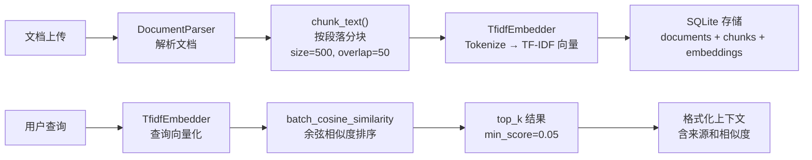
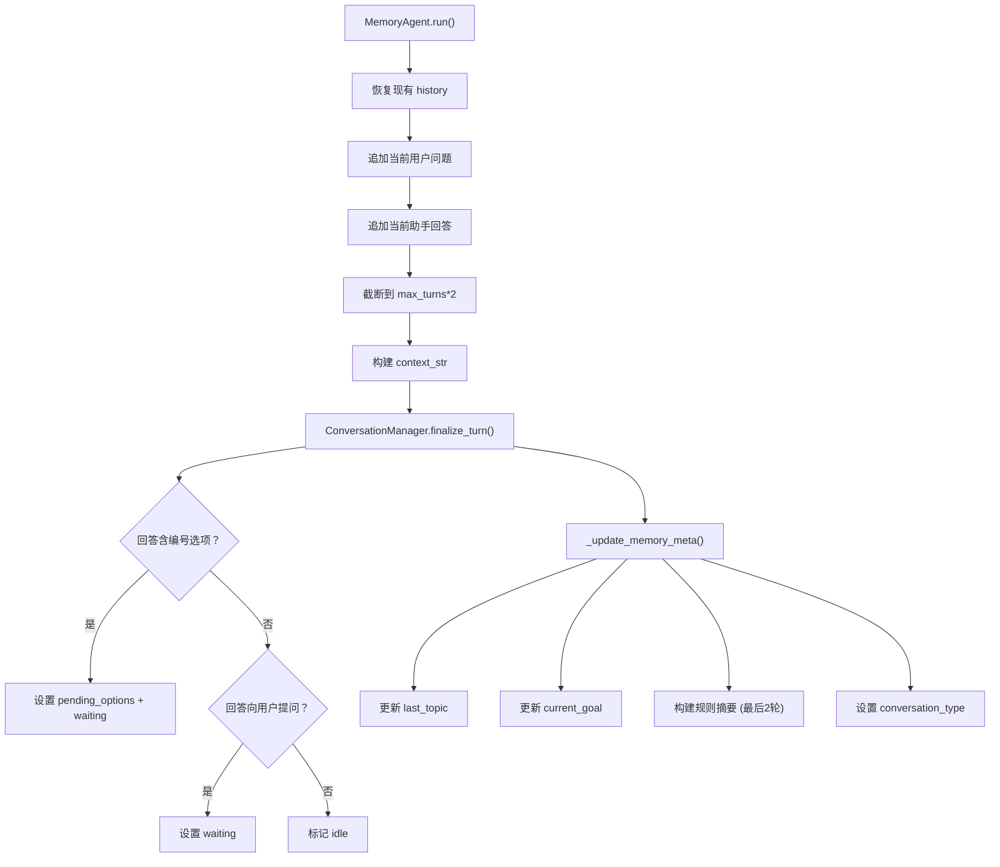
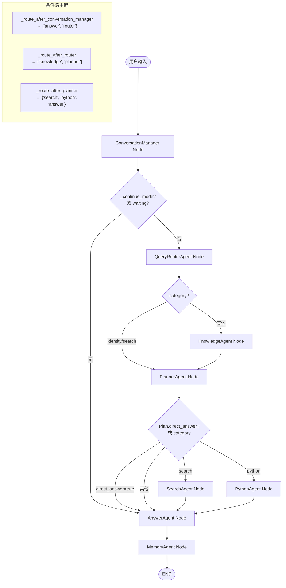
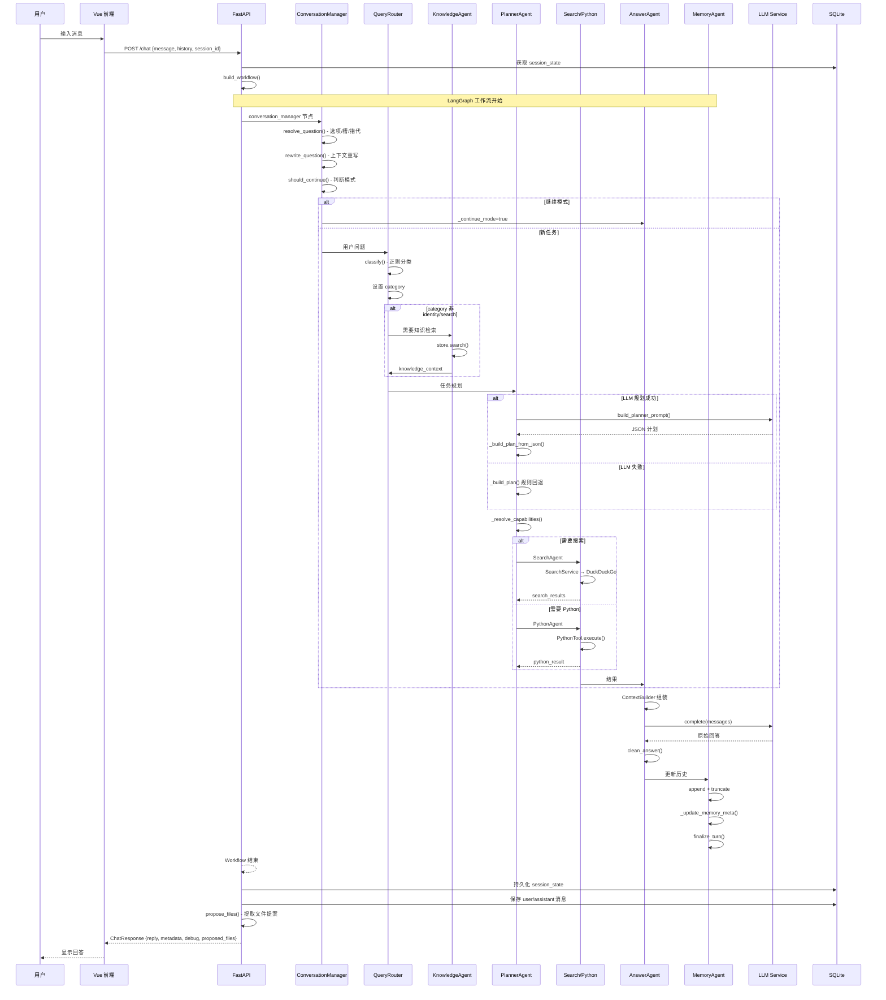

# OmniForge 项目架构文档

> 生成日期：2026-07-06
> 版本：0.1.0

---

## 1. 项目介绍

### 项目名称
**OmniForge**（曾用名：AgentFlow）

### 项目目的
OmniForge 是一个模块化多智能体（Multi-Agent）AI 工作台，专为开发者设计。它通过编排多个专业化 Agent（规划、搜索、知识检索、Python 执行、报告生成、记忆管理），解决复杂的用户任务。

### 解决什么问题
- 将用户的一个复杂问题分解为多个子任务，分配给最适合的 Agent 处理
- 提供持续对话能力，支持上下文理解、指代消解和连续对话
- 集成知识库（RAG）和网络搜索，增强 LLM 回答的准确性和时效性
- 提供 Python 代码沙箱执行环境
- 通过 LangGraph 状态机编排 Agent 工作流

### 整体架构

```
┌─────────────────────────────────────────────────────────────┐
│                     用户 (User)                              │
└──────────────────────────┬──────────────────────────────────┘
                           │
                           ▼
┌──────────────────────────────────────────────────────────────┐
│                    FastAPI 后端 (Port 8000)                   │
│  ┌──────────────────────────────────────────────────────┐   │
│  │                API 路由 (routes.py)                    │   │
│  │  /chat  /upload  /history  /sessions  /knowledge     │   │
│  │  /models  /agents  /files  /workspace                │   │
│  └──────────────────────┬───────────────────────────────┘   │
│                         │                                    │
│                         ▼                                    │
│  ┌──────────────────────────────────────────────────────┐   │
│  │              LangGraph Workflow (workflow.py)         │   │
│  │  StateGraph with 8 nodes, conditional edges          │   │
│  └──────────────────────┬───────────────────────────────┘   │
│                         │                                    │
└─────────────────────────┼────────────────────────────────────┘
                          │
                          ▼
┌──────────────────────────────────────────────────────────────┐
│                   Agent 系统                                  │
│                                                              │
│  ┌─────────────────┐    ┌──────────────────┐                │
│  │ Conversation    │    │  Query Router    │                │
│  │ Manager (入口)   │───▶│  (意图分类)      │                │
│  └─────────────────┘    └────────┬─────────┘                │
│                                  │                          │
│                     ┌────────────┼────────────┐            │
│                     ▼            ▼            ▼            │
│              ┌──────────┐ ┌──────────┐ ┌──────────┐       │
│              │Planner   │ │Knowledge │ │ Answer   │       │
│              │(任务规划) │ │(知识检索) │ │(答案生成) │       │
│              └────┬─────┘ └──────────┘ └──────────┘       │
│                   │                                        │
│            ┌──────┼──────────┐                            │
│            ▼      ▼          ▼                            │
│      ┌────────┐ ┌────────┐ ┌────────┐                    │
│      │Search  │ │Python  │ │Memory  │                    │
│      │(搜索)  │ │(代码执行)│ │(记忆)  │                    │
│      └────────┘ └────────┘ └────────┘                    │
│                                                           │
└───────────────────────────────────────────────────────────┘
                          │
                          ▼
┌──────────────────────────────────────────────────────────────┐
│                  基础设施层                                    │
│                                                              │
│  ┌──────────┐ ┌───────────┐ ┌──────────┐ ┌──────────────┐  │
│  │ LLM      │ │ SQLite    │ │ Tools    │ │ RAG (TF-IDF) │  │
│  │Service   │ │ Database  │ │ (Search  │ │ Knowledge    │  │
│  │(DeepSeek)│ │           │ │ Python)  │ │ Store        │  │
│  └──────────┘ └───────────┘ └──────────┘ └──────────────┘  │
│                                                              │
└──────────────────────────────────────────────────────────────┘
```

### 技术栈

| 层级 | 技术 |
|------|------|
| **后端框架** | Python 3.12+, FastAPI 0.111+ |
| **工作流引擎** | LangGraph 0.2+ |
| **LLM API** | OpenAI SDK (兼容 DeepSeek API) |
| **数据库** | SQLite (WAL 模式) |
| **前端** | Vue 3 + TypeScript + Vite + TailwindCSS |
| **搜索** | DuckDuckGo HTML 爬取 |
| **RAG 向量化** | 自研 TF-IDF (numpy) |
| **文档解析** | pypdf, python-docx |
| **工具** | uv (包管理), hatchling (构建) |
| **容器化** | Docker, docker-compose |
| **测试** | pytest |

### 运行方式

```bash
# 后端
uv sync
uv run uvicorn agentflow.app.main:app --reload --host 0.0.0.0 --port 8000

# 前端 (开发模式)
cd frontend
npm install
npm run dev
```

### 部署方式

```bash
docker compose -f agentflow/docker/docker-compose.yml up --build
```

### 主要模块

| 模块 | 路径 | 职责 |
|------|------|------|
| **API** | `agentflow/api/` | REST 接口层 |
| **Agents** | `agentflow/agents/` | 8 个专业化 Agent |
| **Graph** | `agentflow/graph/` | LangGraph 工作流定义 |
| **Conversation** | `agentflow/conversation/` | 对话运行时（上下文理解、状态跟踪） |
| **Tools** | `agentflow/tools/` | 可执行工具（搜索、Python） |
| **Services** | `agentflow/services/` | 业务逻辑（LLM、搜索、文件提案） |
| **Knowledge** | `agentflow/knowledge/` | RAG 知识库（解析、嵌入、检索） |
| **Database** | `agentflow/database/` | SQLite 持久化层 |
| **Config** | `agentflow/config/` | 中心化配置 |
| **Models** | `agentflow/models/` | Pydantic 数据模型 |
| **Prompts** | `agentflow/prompts/` | LLM 提示模板 |
| **Frontend** | `frontend/` | Vue 3 前端界面 |

### 当前完成度

- ✅ Agent 工作流编排（LangGraph）
- ✅ 查询路由（基于正则）
- ✅ LLM 驱动的任务规划（带规则回退）
- ✅ 网络搜索（DuckDuckGo）
- ✅ Python 代码沙箱执行
- ✅ RAG 知识库（TF-IDF + 文档解析）
- ✅ LLM 答案生成
- ✅ 会话历史管理
- ✅ 对话运行时（Phase 7-8：上下文理解、连续对话、指代消解、实体跟踪）
- ✅ 多 LLM 模型配置管理
- ✅ 文件提案（代码块 → 文件创建）
- ✅ 工作区管理
- ✅ RESTful API
- ✅ Vue 3 前端界面
- ✅ Docker 部署支持
- ✅ 事件系统（EventBus）
- ✅ Task 生命周期管理

### 未来规划

- 🔲 更多搜索服务商（Tavily, Firecrawl, Google Search）
- 🔲 更丰富的文档解析（图片OCR、表格）
- 🔲 Redis -backed session 和记忆扩展
- 🔲 渲染更复杂的报告
- 🔲 安全沙箱 Python 执行
- 🔲 WebSocket / SSE 实时流式传输
- 🔲 Agent 间通信的事件驱动架构增强
- 🔲 语义嵌入（sentence-transformers）替代 TF-IDF

---

## 2. 项目整体架构（Mermaid）

### 完整架构图

```mermaid
graph TB
    subgraph "用户层"
        User["用户"]
        Browser["浏览器 / 前端"]
    end

    subgraph "API 层"
        FastAPI["FastAPI 应用<br/>agentflow/app/main.py"]
        CORS["CORS 中间件"]
        Router["API 路由<br/>agentflow/api/routes.py"]
        Health["/health 端点"]
    end

    subgraph "工作流层 (LangGraph)"
        WG["Workflow StateGraph<br/>agentflow/graph/workflow.py"]
        WSC["WorkflowState<br/>TypedDict"]
        WFC["WorkflowContext<br/>dict 子类<br/>agentflow/graph/context.py"]
        
        subgraph "节点"
        CM["ConversationManager Node<br/>入口/重写/路由决策"]
        RouterNode["QueryRouter Node<br/>意图分类"]
        PlannerNode["Planner Node<br/>任务规划"]
        SearchNode["Search Node<br/>网络搜索"]
        KnowledgeNode["Knowledge Node<br/>知识检索"]
        PythonNode["Python Node<br/>代码执行"]
        AnswerNode["Answer Node<br/>答案生成"]
        MemoryNode["Memory Node<br/>记忆更新"]
        end
    end

    subgraph "Agent 层"
        ConvMgr["ConversationManager<br/>agentflow/conversation/manager.py"]
        QA["QueryRouterAgent<br/>agentflow/agents/router/agent.py"]
        PA["PlannerAgent<br/>agentflow/agents/planner/agent.py"]
        SA["SearchAgent<br/>agentflow/agents/search/agent.py"]
        KA["KnowledgeAgent<br/>agentflow/agents/knowledge/agent.py"]
        PyA["PythonAgent<br/>agentflow/agents/python/agent.py"]
        AA["AnswerAgent<br/>agentflow/agents/answer/agent.py"]
        MA["MemoryAgent<br/>agentflow/agents/memory/agent.py"]
    end

    subgraph "对话运行时"
        SS["SessionState<br/>会话状态追踪<br/>agentflow/conversation/session_state.py"]
        CS["ConversationState<br/>话题/实体/焦点追踪<br/>agentflow/conversation/state.py"]
        CC["ConversationContext<br/>回合上下文<br/>agentflow/conversation/context.py"]
        RE["RewriteEngine<br/>问题重写<br/>agentflow/conversation/rewrite.py"]
    end

    subgraph "执行层"
        Exec["Executor<br/>Task 生命周期管理<br/>agentflow/graph/executor.py"]
        Task["Task<br/>工作单元<br/>agentflow/graph/task.py"]
        Plan["Plan<br/>执行计划<br/>agentflow/graph/plan.py"]
        Event["EventBus<br/>事件系统<br/>agentflow/graph/event.py"]
    end

    subgraph "工具层"
        BT["BaseTool<br/>抽象接口<br/>agentflow/tools/base.py"]
        ST["SearchTool<br/>搜索工具<br/>agentflow/tools/search_tool.py"]
        PT["PythonTool<br/>Python 执行工具<br/>agentflow/tools/python_tool.py"]
    end

    subgraph "服务层"
        LLMS["LLMService<br/>LLM 调用<br/>agentflow/services/llm_service.py"]
        SServ["SearchService<br/>搜索业务逻辑<br/>agentflow/services/search_service.py"]
        SP["SearchProvider<br/>DuckDuckGo<br/>agentflow/services/search_provider.py"]
        FP["FileProposer<br/>文件提案<br/>agentflow/services/file_proposer.py"]
    end

    subgraph "知识库 (RAG)"
        KS["KnowledgeStore<br/>知识库管理<br/>agentflow/knowledge/store.py"]
        TE["TfidfEmbedder<br/>TF-IDF 向量化<br/>agentflow/knowledge/embedder.py"]
        DP["DocumentParser<br/>文档解析<br/>agentflow/knowledge/parser.py"]
    end

    subgraph "持久化层"
        DB["SQLiteStore<br/>agentflow/database/sqlite.py"]
        DBFile["agentflow.db<br/>(WAL 模式)"]
    end

    subgraph "LLM 层"
        API_LLM["DeepSeek API<br/>或其他 OpenAI 兼容 API"]
    end

    subgraph "前端 (Vue 3)"
        AppVue["App.vue"]
        Sidebar["Sidebar 组件"]
        ChatView["ChatView 组件"]
        KnowledgeView["KnowledgeView 组件"]
        SettingsView["ModelsSettings 组件"]
        ApiClient["API Client<br/>axios"]
    end

    User --> Browser
    Browser --> FastAPI
    FastAPI --> CORS
    CORS --> Router
    Router --> Health
    Router --> WG
    WG --> WSC
    WG --> WFC
    WG --> CM
    WG --> RouterNode
    WG --> PlannerNode
    WG --> SearchNode
    WG --> KnowledgeNode
    WG --> PythonNode
    WG --> AnswerNode
    WG --> MemoryNode

    CM --> ConvMgr
    RouterNode --> QA
    PlannerNode --> PA
    SearchNode --> SA
    KnowledgeNode --> KA
    PythonNode --> PyA
    AnswerNode --> AA
    MemoryNode --> MA

    ConvMgr --> SS
    ConvMgr --> CS
    ConvMgr --> CC
    ConvMgr --> RE

    PA --> Plan
    Plan --> Exec
    Exec --> Task
    Exec --> BT
    BT --> ST
    BT --> PT
    Event -.-> Exec

    SA --> SServ
    SServ --> ST
    ST --> SP

    KA --> KS
    KS --> TE
    KS --> DP

    AA --> LLMS
    PA --> LLMS

    SS --> DB
    KS --> DB
    DB --> DBFile

    LLMS --> API_LLM

    AppVue --> Sidebar
    AppVue --> ChatView
    AppVue --> KnowledgeView
    AppVue --> SettingsView
    ChatView --> ApiClient
    ApiClient --> Router
```



---

## 3. 项目启动流程

### 入口：`agentflow/app/main.py`

```
uvicorn agentflow.app.main:app --reload --host 0.0.0.0 --port 8000
```

**启动步骤：**

```
1. uvicorn 加载 app 对象 (FastAPI 实例)
   ├── 导入 from agentflow.api.routes import router
   │     ├── from agentflow.agents.registry import get_all  # 注册所有 Agent
   │     ├── from agentflow.database.sqlite import SQLiteStore  # 初始化数据库
   │     ├── from agentflow.graph.workflow import build_workflow  # 工作流构建
   │     ├── from agentflow.knowledge.store import KnowledgeStore  # 知识库
   │     └── from agentflow.models.chat import ChatRequest, ChatResponse
   │
   ├── 导入 from agentflow.config.settings import settings
   │     ├── load_dotenv() 读取 .env 文件
   │     └── Settings 类解析所有环境变量
   │
   ├── 导入 from agentflow.utils.logging import build_logger
   │     └── 创建 agentflow.log 日志文件 + 控制台输出
   │
   ├── 创建 FastAPI 实例 (title="OmniForge")
   ├── 注册 CORS 中间件 (允许 localhost:5173/5174)
   ├── 注册路由 (app.include_router(router))
   └── 注册 /health 端点

2. 服务器就绪，等待请求

3. 收到 POST /chat 请求后的调用链：
   a. FastAPI 解析请求为 ChatRequest
   b. session_id 处理：
      - 若未提供 → 创建新 session
      - 若提供 → 验证 session 存在
   c. build_workflow() → 构建 LangGraph StateGraph
   d. 从 DB 加载 session_state
   e. run_workflow(graph, message, history, session_state)
   f. 持久化 session_state → DB
   g. store.add_message() 保存 user 和 assistant 消息
   h. 自动标题（若标题为默认"新对话"）
   i. propose_files(result["answer"]) 提取文件提案
   j. 返回 ChatResponse
```

### build_workflow() 内部创建流程

```python
1. ConversationManager()  # 对话管理器
2. QueryRouterAgent()     # 查询路由
3. PlannerAgent()         # 任务规划
4. SearchAgent()          # 搜索
5. AnswerAgent()          # 回答
6. MemoryAgent()          # 记忆
7. KnowledgeAgent()       # 知识
8. PythonAgent()          # Python 执行
9. _build_executor()      # 执行器 (注册 SearchTool + PythonTool)

10. StateGraph(WorkflowState)  # 创建状态图
11. 添加 8 个节点
12. 设置入口点为 "conversation_manager"
13. 添加条件边 (3 个 conditional edges)
14. 添加直连边 (4 个 edges)
15. workflow.compile() → 返回编译后的图
```

---

## 4. Agent 系统详解

### Agent 列表

| Agent | 类 | 文件 | 职责 | 状态 |
|-------|---|------|------|------|
| **ConversationManager** | `ConversationManager` | `manager.py` | 入口节点：解析、重写、路由决策 | active |
| **QueryRouter** | `QueryRouterAgent` | `router/agent.py` | 基于正则的意图分类 | active |
| **Planner** | `PlannerAgent` | `planner/agent.py` | LLM 驱动的任务规划 (规则回退) | active |
| **Search** | `SearchAgent` | `search/agent.py` | 网络搜索决策 | active |
| **Knowledge** | `KnowledgeAgent` | `knowledge/agent.py` | 知识库检索 | active |
| **Python** | `PythonAgent` | `python/agent.py` | Python 代码执行 | active |
| **Answer** | `AnswerAgent` | `answer/agent.py` | 最终答案生成 | active |
| **Memory** | `MemoryAgent` | `memory/agent.py` | 跨轮会话历史维护 | active |
| **Report** | `ReportAgent` | `report/agent.py` | 报告生成（替代 Answer） | inactive |

### Agent 通信机制

Agent 之间通过 **LangGraph StateGraph** 的共享 `WorkflowState`（TypedDict）进行通信：

```python
class WorkflowState(TypedDict, total=False):
    question: str           # 用户问题
    workflow: list[str]     # 工作流阶段列表
    category: str           # 查询分类
    plan: dict              # 执行计划
    search_results: list    # 搜索结果
    knowledge_results: list # 知识结果
    knowledge_context: str  # 知识上下文文本
    python_result: dict     # Python 执行结果
    answer: str             # 最终答案
    memory: dict            # 记忆数据
    history: list           # 历史消息
    router: dict            # 路由元数据
    session_state: dict     # 会话状态 (序列化 SessionState)
    _continue_mode: bool    # 继续模式标志
    session_context: str    # 可读的会话上下文
    rewritten_question: str # 重写后的问题
    conversation_context: ConversationContext  # 回合上下文
```

每个 Agent 的 `run(state)` 方法接收并修改此状态，LangGraph 确保数据在节点间正确传递。

### 各 Agent 详细说明

#### ConversationManager (`agentflow/conversation/manager.py`)
- **职责**: 工作流入口节点，决定本轮是"继续"还是"新任务"
- **核心方法**:
  - `resolve_question()`: 解析用户输入（选项解析、槽填充、指代消解）
  - `rewrite_question()`: 用会话上下文重写短/指代问题
  - `should_continue()`: 判断是否需要继续模式
  - `build_conversation_context()`: 构建结构化回合上下文
  - `finalize_turn()`: 回合结束后更新 session_state
- **输出**: `_continue_mode`, `session_state`, `rewritten_question`, `conversation_context`
- **条件路由**: continue_mode → Answer 节点；否则 → Router 节点

#### QueryRouterAgent (`agentflow/agents/router/agent.py`)
- **职责**: 基于正则表达式分类用户意图
- **分类**: identity, search, coding, writing, python, reasoning, knowledge
- **方法**: `classify()`, `match_any()`
- **优先使用** `rewritten_question`（若存在）而非原始 `question`
- **条件路由**: identity/search → Planner（跳过知识检索）；其他 → Knowledge → Planner

#### PlannerAgent (`agentflow/agents/planner/agent.py`)
- **职责**: 生成执行计划，包含具体 Task
- **双路径设计**:
  1. **LLM 主路径**: 调用 LLM 生成 JSON 格式计划，解析为 Plan 对象
  2. **规则回退**: LLM 失败时，基于 category 生成规则计划
- **核心方法**:
  - `_llm_plan()`: LLM 规划路径
  - `_parse_json()`: 鲁棒的 JSON 解析（支持 ```json 代码块）
  - `_build_plan()`: 规则回退
  - `_resolve_capabilities()`: 能力 → 工具名映射
- **输出**: Plan (含 Task 列表), workflow (后向兼容)

#### SearchAgent (`agentflow/agents/search/agent.py`)
- **职责**: 判断是否执行搜索，委托给 SearchService
- **流程**: category == "search" → 执行搜索；否则设置空结果
- **不直接持有 SearchTool**，通过 SearchService 解耦

#### KnowledgeAgent (`agentflow/agents/knowledge/agent.py`)
- **职责**: 从本地知识库检索相关文档块
- **流程**: 调用 KnowledgeStore.search() → 格式化结果 → 设置 knowledge_context
- **使用**: TF-IDF 向量化和余弦相似度

#### PythonAgent (`agentflow/agents/python/agent.py`)
- **职责**: 从用户消息中提取 Python 代码并执行
- **流程**: 正则提取 ` ```python ` 代码块 → PythonTool.execute()
- **支持**: 直接输入纯 Python 代码（用 ast.parse 验证）

#### AnswerAgent (`agentflow/agents/answer/agent.py`)
- **职责**: 根据所有上下文生成最终答案
- **核心组件**:
  - `ContextBuilder`: 结构化组装所有上下文（会话、记忆、知识、搜索、历史）
  - `_system_prompt()`: 根据 continue_mode 返回不同的系统提示
  - `_build_history()`: 提取最近的对话历史
  - `_format_search_context()`: 格式化搜索结果
- **调用**: LLMService.complete()

#### MemoryAgent (`agentflow/agents/memory/agent.py`)
- **职责**: 跨轮维护对话历史
- **输出**: memory.history, memory.summary, memory.current_goal, memory.last_topic...
- **额外**: 调用 `ConversationManager.finalize_turn()` 更新 session_state
- **跟踪**: 对话类型（single_turn/follow_up/multi_turn）

### Prompt 分析

| Prompt | 位置 | 调用时机 | 作用 |
|--------|------|----------|------|
| Planner System Prompt | `agents/planner/prompt.py` | PlannerAgent._llm_plan() | 指示 LLM 输出 JSON 格式任务计划 |
| Answer System Prompt | `agents/answer/agent.py` (动态) | AnswerAgent.run() | 根据 continue_mode 不同提示 |
| ContextBuilder prompt | `agents/answer/agent.py` | ContextBuilder.build_user_prompt() | 组装所有上下文源 |
| Report System Prompt | `agents/report/agent.py` | ReportAgent.run() | 简洁中文回答 |
| planner.md | `prompts/planner.md` | 仅参考 | 遗留提示模板 |
| knowledge.md | `prompts/knowledge.md` | 仅参考 | 遗留提示模板 |
| search.md | `prompts/search.md` | 仅参考 | 遗留提示模板 |
| report.md | `prompts/report.md` | 仅参考 | 遗留提示模板 |

---

## 5. RAG 系统

### 文件结构

```
agentflow/knowledge/
├── __init__.py
├── store.py       # KnowledgeStore — 高级接口
├── embedder.py    # TfidfEmbedder — TF-IDF 向量化
└── parser.py      # 文档解析 (PDF/DOCX/MD/TXT)
```

### 完整流程



### 组件说明

#### DocumentParser (`agentflow/knowledge/parser.py`)
- **支持格式**: PDF (pypdf), DOCX (python-docx), Markdown, TXT
- **分块策略**: 按段落边界，目标 500 字符/块，50 字符重叠
- **编码**: UTF-8 优先，自动回退 GBK/Latin-1

#### TfidfEmbedder (`agentflow/knowledge/embedder.py`)
- **分词**: 中文按单字，英文按单词
- **TF-IDF**: 标准化词频 × 平滑逆文档频率
- **向量存储**: numpy float32 数组序列化为 BLOB
- **相似度**: 余弦相似度（L2 归一化后点积）
- **可序列化**: to_dict() / from_dict() 用于数据库持久化

#### KnowledgeStore (`agentflow/knowledge/store.py`)
- **管理**: 文档增删、嵌入、搜索的完整生命周期
- **状态持久化**: embedder 词汇表在 database.knowledge_meta 表中

### 检索查询

```python
results = store.search(
    query="用户查询",
    top_k=5,        # 最多返回结果数
    min_score=0.05  # 最小相似度阈值
)
# 返回: [{chunk_id, document_id, filename, content, score}]
```

---

## 6. Tool 系统

### BaseTool 抽象接口 (`agentflow/tools/base.py`)

```python
class BaseTool(ABC):
    name: str = ""
    @abstractmethod
    def execute(**kwargs) -> Any: ...
```

所有 Tool 必须继承 `BaseTool` 并实现 `execute()`。

### 注册的 Tool

| Tool | 名称 | 执行方法 | 注册位置 | Capability |
|------|------|----------|----------|------------|
| **SearchTool** | `search` | `execute(query="")` | `Executor._build_executor()` | `web.search` |
| **PythonTool** | `python` | `execute(code="")` | `Executor._build_executor()` | `python.execute` |
| **知识检索** | 无工具 | 直接调用 KnowledgeStore | KnowledgeAgent | `knowledge.retrieve`（无工具绑定） |

### Executor (`agentflow/graph/executor.py`)
- **职责**: Task 生命周期管理
- **状态机**: PENDING → READY → RUNNING → COMPLETED / FAILED
- **事件**: 通过 EventBus 发射 task.created/started/finished/failed 事件

### Capability Registry (`agentflow/agents/planner/capability.py`)

```python
_REGISTRY = [
    ("web.search",        "search",  "从互联网搜索最新信息"),
    ("knowledge.retrieve", None,      "从本地知识库检索文档资料"),
    ("python.execute",    "python",  "执行 Python 代码并获取运行结果"),
]
```

注意：`knowledge.retrieve` 被识别但无工具绑定——直接在 KnowledgeAgent 中执行。

### Planner → Executor 流程

```
PlannerAgent._llm_plan()
  → LLM 输出 JSON (capabilities)
  → Plan 对象 (含 Task.goal + Task.capability)
  → _resolve_capabilities() (capability → tool name)
  → Executor.execute(task) (按 tool 名称路由)
  → tool.execute(**task.input)
```

---

## 7. Memory 系统

### 记忆类型

| 类型 | 位置 | 内容 | 持久化 |
|------|------|------|--------|
| **对话历史** | WorkflowState.memory | history: [{role, content}] | SQLite (chats 表) |
| **会话状态** | WorkflowState.session_state | SessionState: goal, task, slots, options | SQLite (sessions.session_state) |
| **话题追踪** | SessionState.tracking | ConversationState: topic, entities, focus | SQLite (序列化在 session_state 内) |
| **摘要记忆** | WorkflowState.memory.summary | 规则生成的对话摘要 | 仅运行时，不持久化 |
| **长期记忆** | 无 | 未实现 | - |
| **向量记忆** | KnowledgeStore | TF-IDF 嵌入 | SQLite (embeddings 表) |

### Memory 更新流程



---

## 8. 工作流（完整流程图）



### 实际工作流示例

| 输入 | 路径 |
|------|------|
| "你好" | CM → Router(identity) → Planner(direct_answer) → Answer → Memory |
| "今天天气怎么样" | CM → Router(search) → Planner(search task) → Search → Answer → Memory |
| "什么是机器学习" | CM → Router(knowledge) → Knowledge → Planner(direct_answer) → Answer → Memory |
| "写一个 Python 贪吃蛇" | CM → Router(coding) → Knowledge → Planner(python task) → Python → Answer → Memory |
| "继续" (有 session_state) | CM(continue) → Answer → Memory |
| "选项二" (有 pending_options) | CM(continue) → Answer → Memory |

---

## 9. API 接口

| 方法 | 路径 | 用途 |
|------|------|------|
| POST | `/chat` | 聊天请求 |
| GET | `/agents` | 列出所有 Agent |
| POST | `/upload` | 上传文档到知识库 |
| GET | `/knowledge/documents` | 列出文档 |
| DELETE | `/knowledge/documents/{id}` | 删除文档 |
| POST | `/knowledge/search` | 搜索知识库 |
| GET | `/history` | 获取聊天历史 |
| POST | `/files/create` | 创建文件 |
| GET | `/files` | 列出输出文件 |
| POST | `/sessions/create` | 创建会话 |
| GET | `/sessions` | 列出会话 |
| GET | `/sessions/{id}/messages` | 获取会话消息 |
| PUT | `/sessions/{id}/rename` | 重命名会话 |
| DELETE | `/sessions/{id}` | 删除会话 |
| GET | `/workspace` | 检查工作区 |
| POST | `/workspace/set` | 设置工作区 |
| POST | `/workspace/create-folder` | 创建文件夹 |
| GET | `/workspace/browse` | 浏览目录 |
| GET | `/models` | 列出模型配置 |
| POST | `/models` | 创建模型配置 |
| PUT | `/models/{id}` | 更新模型配置 |
| DELETE | `/models/{id}` | 删除模型配置 |
| POST | `/models/{id}/activate` | 激活模型 |
| GET | `/health` | 健康检查 |

---

## 10. 数据流（用户输入到输出）



---

## 11. 模块依赖关系

```mermaid
graph TD
    %% 顶层模块
    subgraph "入口"
        MAIN["app/main.py<br/>FastAPI App"]
        ROUTES["api/routes.py<br/>API 路由"]
    end

    subgraph "配置"
        SETTINGS["config/settings.py<br/>Settings + .env"]
        LOGGING["utils/logging.py<br/>日志"]
    end

    subgraph "模型定义"
        CHAT_MODEL["models/chat.py<br/>ChatRequest/Response"]
        MODEL_CFG["models/model_config.py<br/>LLM Config Models"]
    end

    subgraph "工作流"
        WF["graph/workflow.py<br/>LangGraph Workflow"]
        CTX["graph/context.py<br/>WorkflowContext"]
        TASK["graph/task.py<br/>Task"]
        PLAN["graph/plan.py<br/>Plan"]
        EVT["graph/event.py<br/>EventBus"]
        EXEC["graph/executor.py<br/>Executor"]
    end

    subgraph "Agent 系统"
        REG["agents/registry.py<br/>Agent Registry"]
        CM["conversation/manager.py<br/>ConversationManager"]
        RE["conversation/rewrite.py<br/>RewriteEngine"]
        SS["conversation/session_state.py<br/>SessionState"]
        CS["conversation/state.py<br/>ConversationState"]
        CC["conversation/context.py<br/>ConversationContext"]
        ROUTER["agents/router/agent.py<br/>QueryRouterAgent"]
        PLANNER["agents/planner/agent.py<br/>PlannerAgent"]
        CAP["agents/planner/capability.py<br/>Capability Registry"]
        PP["agents/planner/prompt.py<br/>Planner Prompt"]
        SEARCH["agents/search/agent.py<br/>SearchAgent"]
        KNOW["agents/knowledge/agent.py<br/>KnowledgeAgent"]
        PYTHON["agents/python/agent.py<br/>PythonAgent"]
        ANSWER["agents/answer/agent.py<br/>AnswerAgent + ContextBuilder"]
        MEMORY["agents/memory/agent.py<br/>MemoryAgent"]
        REPORT["agents/report/agent.py<br/>ReportAgent"]
    end

    subgraph "服务"
        LLM_SVC["services/llm_service.py<br/>LLMService"]
        SEARCH_SVC["services/search_service.py<br/>SearchService"]
        SEARCH_PROV["services/search_provider.py<br/>DuckDuckGoProvider"]
        FILE_PROP["services/file_proposer.py<br/>FileProposer"]
    end

    subgraph "工具"
        BASE_TOOL["tools/base.py<br/>BaseTool"]
        SEARCH_TOOL["tools/search_tool.py<br/>SearchTool"]
        PYTHON_TOOL["tools/python_tool.py<br/>PythonTool"]
    end

    subgraph "知识库"
        KNOW_STORE["knowledge/store.py<br/>KnowledgeStore"]
        EMBEDDER["knowledge/embedder.py<br/>TfidfEmbedder"]
        PARSER["knowledge/parser.py<br/>DocumentParser"]
    end

    subgraph "数据库"
        DB["database/sqlite.py<br/>SQLiteStore"]
        DB_FILE["database/agentflow.db"]
    end

    %% 依赖关系
    MAIN --> ROUTES
    MAIN --> SETTINGS
    MAIN --> LOGGING
    
    ROUTES --> REG
    ROUTES --> DB
    ROUTES --> WF
    ROUTES --> CHAT_MODEL
    ROUTES --> MODEL_CFG
    ROUTES --> KNOW_STORE
    ROUTES --> FILE_PROP
    ROUTES --> LLM_SVC
    
    WF --> CM
    WF --> ROUTER
    WF --> PLANNER
    WF --> SEARCH
    WF --> KNOW
    WF --> PYTHON
    WF --> ANSWER
    WF --> MEMORY
    WF --> EXEC
    
    CTX --> SS
    EXEC --> CTX
    EXEC --> TASK
    EXEC --> EVT
    EXEC --> BASE_TOOL
    EXEC --> SEARCH_TOOL
    EXEC --> PYTHON_TOOL
    
    PLANNER --> LLM_SVC
    PLANNER --> CAP
    PLANNER --> PP
    PLANNER --> PLAN
    PLANNER --> TASK
    
    ANSWER --> LLM_SVC
    
    SEARCH --> SEARCH_SVC
    SEARCH_SVC --> SEARCH_TOOL
    SEARCH_TOOL --> SEARCH_PROV
    
    PYTHON --> PYTHON_TOOL
    
    KNOW --> KNOW_STORE
    KNOW_STORE --> DB
    KNOW_STORE --> EMBEDDER
    KNOW_STORE --> PARSER
    
    CM --> RE
    CM --> SS
    CM --> CS
    CM --> CC
    
    MEMORY --> SS
    MEMORY --> CM
    
    LLM_SVC --> DB
    LLM_SVC --> SETTINGS
    
    DB --> DB_FILE
