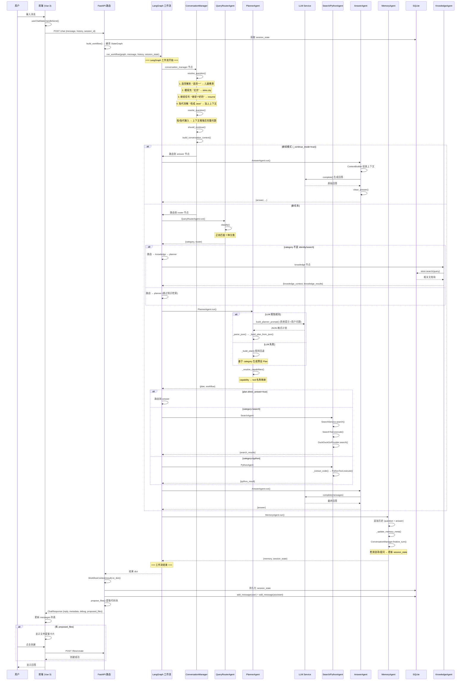
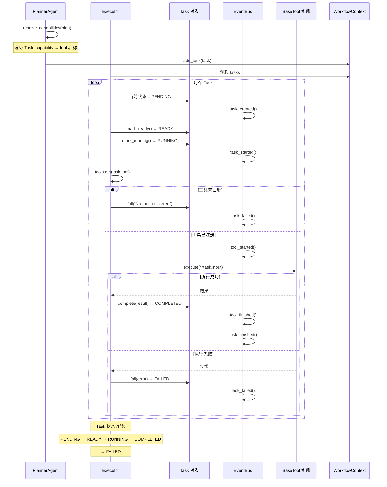
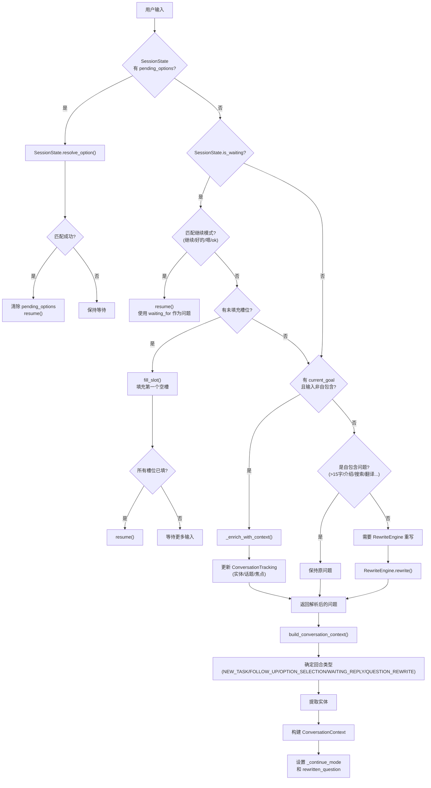
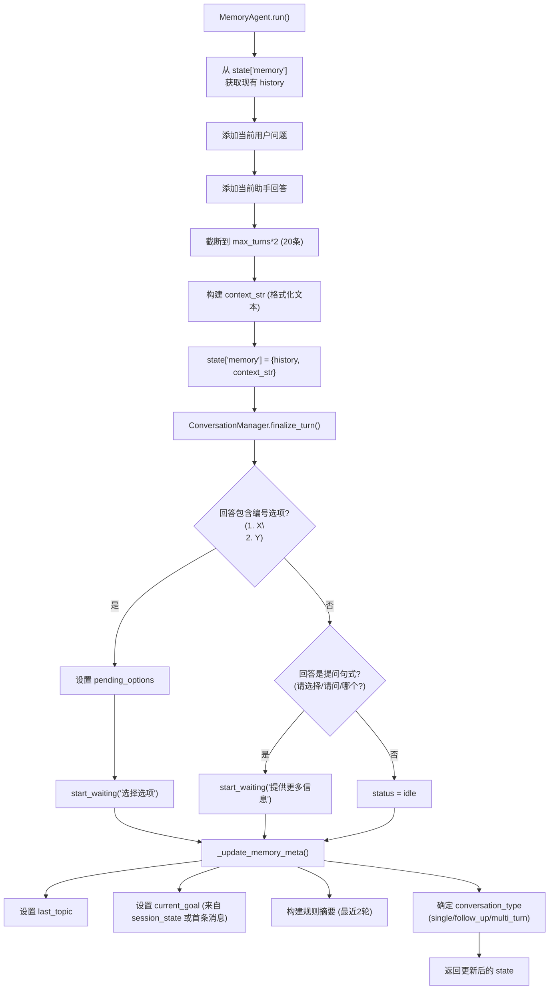
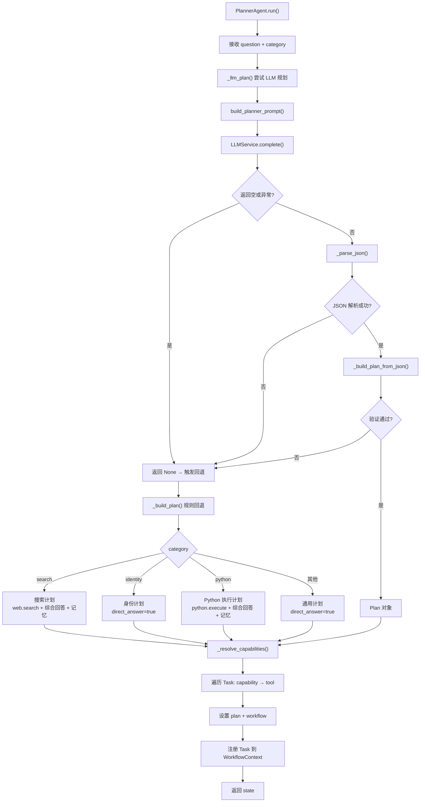
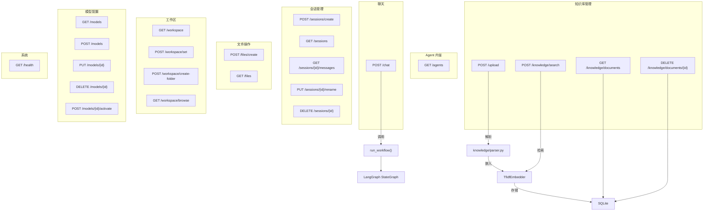
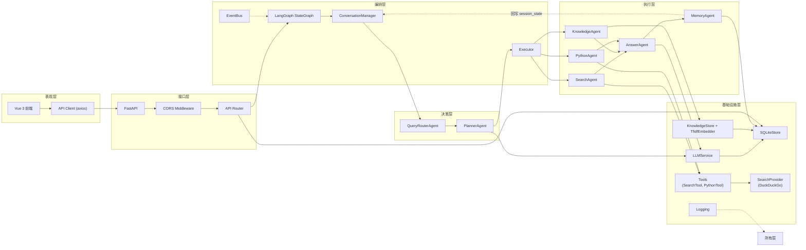

# AI_WORKFLOW — 项目流程图

---

## 1. 完整聊天流程



---

## 2. Tool Calling 流程



---

## 3. 对话运行时流程



---

## 4. Memory 更新流程



---

## 5. RAG 知识库流程

```mermaid
flowchart TD
    subgraph "文档入库"
        A["上传文件"] --> B{"文件类型"}
        B -->|PDF| C["pypdf 解析"]
        B -->|DOCX| D["python-docx 解析"]
        B -->|MD| E["Markdown 解析 (去除frontmatter)"]
        B -->|TXT| F["UTF-8/GBK 自动检测读取"]
        
        C --> G["按段落分块<br/>chunk_text(size=500, overlap=50)"]
        D --> G
        E --> G
        F --> G
        
        G --> H["tokenize()<br/>中文单字+英文单词"]
        H --> I["TfidfEmbedder.add_chunk()"]
        I --> J["vectorize() → numpy TF-IDF 向量"]
        J --> K["serialize_vector() → BLOB"]
        K --> L["SQLite 存储:<br/>documents + chunks + embeddings"]
        L --> M["_save_embedder_state()"]
    end

    subgraph "检索查询"
        N["用户查询"] --> O["tokenize()"]
        O --> P["vectorize() → 查询向量"]
        P --> Q["从 SQLite 读取所有嵌入向量"]
        Q --> R["batch_cosine_similarity()"]
        R --> S["按相似度排序"]
        S --> T["过滤 min_score=0.05"]
        T --> U["取 top_k 结果"]
        U --> V["查询 chunk+document 信息"]
        V --> W["返回 {chunk_id, filename, content, score}"]
    end

    subgraph "文档删除"
        X["delete_document(id)"] --> Y["获取所有 chunks"]
        Y --> Z["对每个 chunk: remove_chunk(tokens)"]
        Z --> AA["delete_document_cascade()"]
        AA --> AB["_save_embedder_state()"]
    end
```



---

## 6. Planner 任务规划流程



---

## 7. API 路由概览



---

## 8. 数据流分层图



---

## 9. 模块依赖关系图

```mermaid
graph TD
    %% 各层颜色
    classDef api fill:#e1d5e7,stroke:#9673a6
    classDef agent fill:#dae8fc,stroke:#6c8ebf
    classDef graph fill:#d5e8d4,stroke:#82b366
    classDef service fill:#ffe6cc,stroke:#d79b00
    classDef tool fill:#f8cecc,stroke:#b85450
    classDef infra fill:#fff2cc,stroke:#d6b656

    subgraph "API 层"
        MAIN["main.py"] :::api
        ROUTES["routes.py"] :::api
    end

    subgraph "Agent 层" 
        REG["registry.py"] :::agent
        CM["manager.py"] :::agent
        ROUTER["router/agent.py"] :::agent
        PLANNER["planner/agent.py"] :::agent
        SEARCH["search/agent.py"] :::agent
        KNOW["knowledge/agent.py"] :::agent
        PYTHON["python/agent.py"] :::agent
        ANSWER["answer/agent.py"] :::agent
        MEMORY["memory/agent.py"] :::agent
    end

    subgraph "对话运行时"
        SS["session_state.py"] :::agent
        CTX_STATE["state.py"] :::agent
        CC["context.py"] :::agent
        REWRITE["rewrite.py"] :::agent
    end

    subgraph "Graph 层"
        WF["workflow.py"] :::graph
        WFC["context.py"] :::graph
        EXEC["executor.py"] :::graph
        TASK["task.py"] :::graph
        PLAN["plan.py"] :::graph
        EVT["event.py"] :::graph
    end

    subgraph "Service 层"
        LLM_SVC["llm_service.py"] :::service
        SEARCH_SVC["search_service.py"] :::service
        SEARCH_PROV["search_provider.py"] :::service
        FILE_PROP["file_proposer.py"] :::service
    end

    subgraph "Tool 层"
        BASE["base.py"] :::tool
        ST["search_tool.py"] :::tool
        PT["python_tool.py"] :::tool
    end

    subgraph "基础设施"
        DB["sqlite.py"] :::infra
        SETTINGS["settings.py"] :::infra
        LOG["logging.py"] :::infra
        KNOW_STORE["knowledge/store.py"] :::infra
        EMBEDDER["knowledge/embedder.py"] :::infra
        PARSER["knowledge/parser.py"] :::infra
    end

    %% API 依赖
    MAIN --> ROUTES
    ROUTES --> REG
    ROUTES --> WF
    ROUTES --> DB
    ROUTES --> CHAT["models/chat.py"]
    
    %% Workflow 依赖 (Agent 编排)
    WF --> CM
    WF --> ROUTER
    WF --> PLANNER
    WF --> SEARCH
    WF --> KNOW
    WF --> PYTHON
    WF --> ANSWER
    WF --> MEMORY
    WF --> EXEC
    WF --> WFC
    
    %% Executor 依赖
    EXEC --> WFC
    EXEC --> TASK
    EXEC --> EVT
    EXEC --> BASE
    BASE --> ST
    BASE --> PT
    
    %% Planner 依赖
    PLANNER --> LLM_SVC
    PLANNER --> CAP["planner/capability.py"]
    PLANNER --> PROMPT["planner/prompt.py"]
    PLANNER --> PLAN
    
    %% Answer 依赖
    ANSWER --> LLM_SVC
    
    %% Search 依赖
    SEARCH --> SEARCH_SVC
    SEARCH_SVC --> ST
    ST --> SEARCH_PROV
    
    %% Python 依赖
    PYTHON --> PT
    
    %% Knowledge 依赖
    KNOW --> KNOW_STORE
    KNOW_STORE --> DB
    KNOW_STORE --> EMBEDDER
    KNOW_STORE --> PARSER
    
    %% Conversation Manager 依赖
    CM --> SS
    CM --> CTX_STATE
    CM --> CC
    CM --> REWRITE
    
    %% Memory 依赖
    MEMORY --> SS
    MEMORY --> CM
    
    %% LLM Service 依赖
    LLM_SVC --> DB
    LLM_SVC --> SETTINGS
    
    %% 基础设施
    DB --> SETTINGS
    LOG --> SETTINGS
