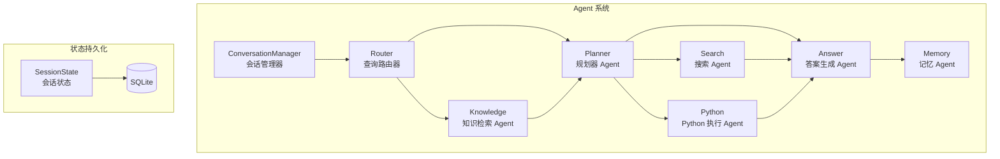
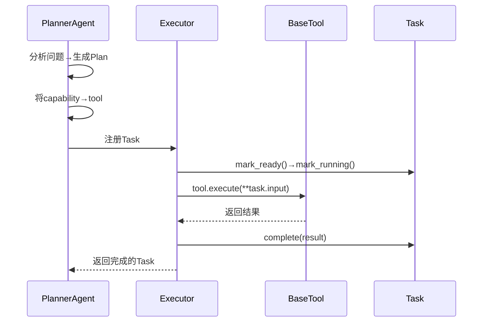
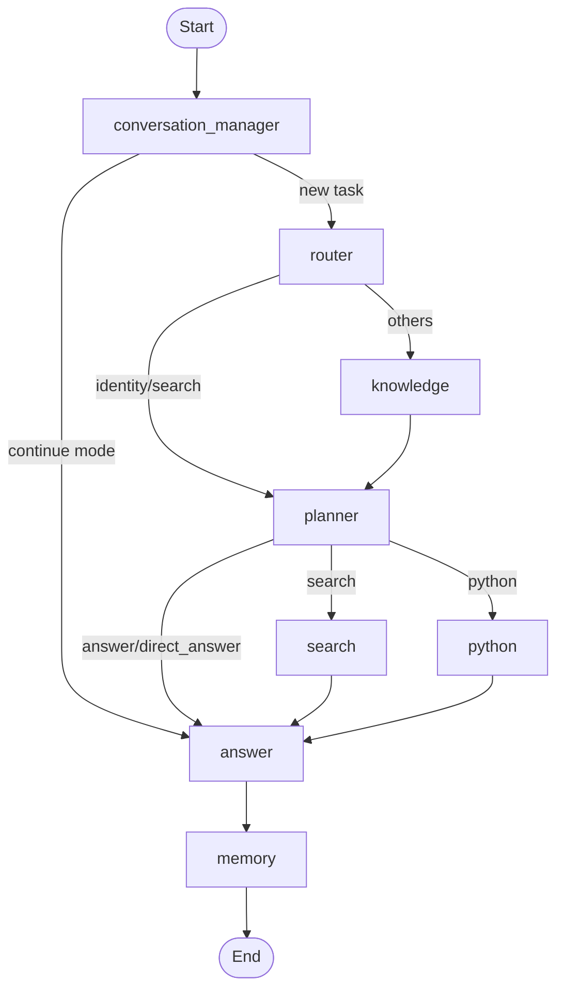
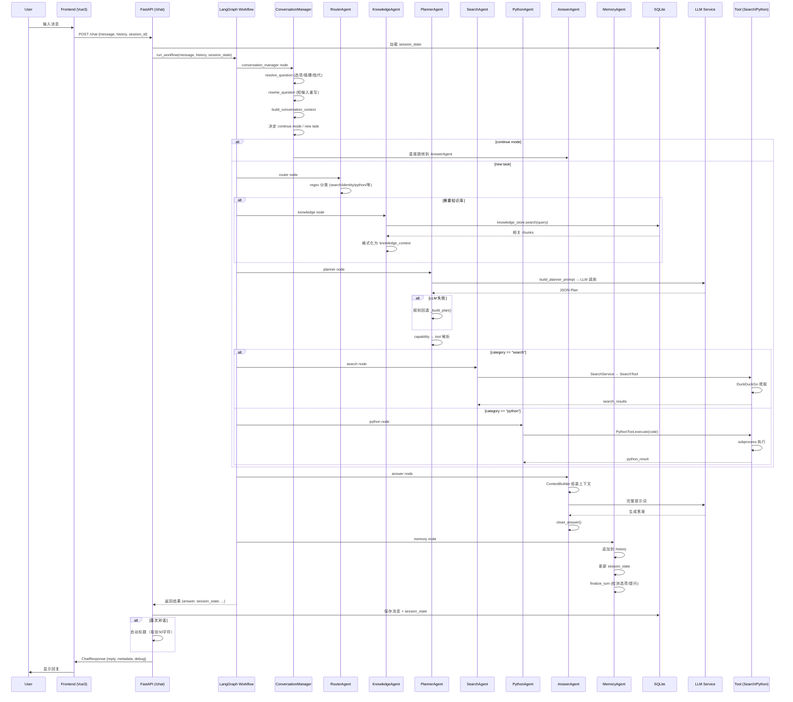
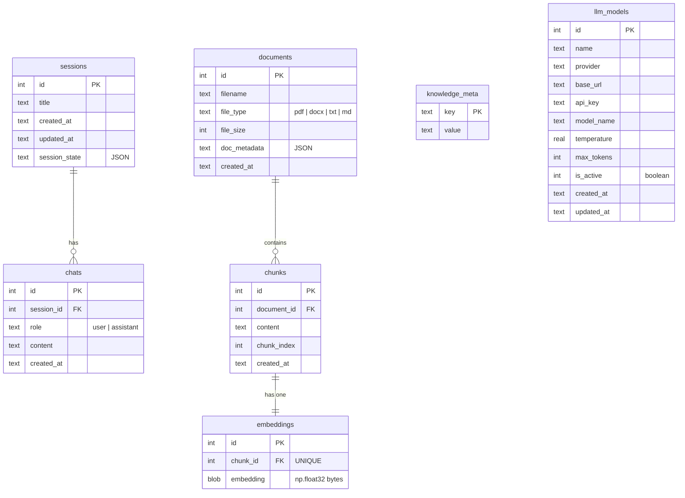

# OmniForge (AgentFlow) 项目架构说明文档

> 生成日期：2026-07-06
> 项目版本：0.1.0

---

## 1. 项目整体介绍

### 项目用途

OmniForge（前身为 AgentFlow）是一个**模块化的多 Agent AI 协作平台**。它通过 LangGraph 编排多个专业化的 AI Agent，实现从**用户意图识别 → 任务规划 → 工具调用 → 知识检索 → 答案生成 → 记忆管理**的完整工作流。项目定位为开发者优先的 AI 工作空间（Developer-first AI Workspace）。

### 主要功能

| 功能 | 说明 |
|------|------|
| **多轮对话** | 支持上下文感知的多轮对话，含会话记忆 |
| **意图路由** | 基于正则模式匹配的用户意图分类 |
| **任务规划** | LLM 驱动 + 规则回退的任务规划 |
| **Web 搜索** | 通过 DuckDuckGo 进行实时网络搜索 |
| **知识库 RAG** | 基于 TF-IDF + 余弦相似度的文档检索增强生成 |
| **Python 执行** | 沙箱化 Python 代码执行 |
| **文件提案** | 自动检测代码块并提议创建文件 |
| **工作区管理** | 支持设置工作目录、创建文件夹、浏览文件 |
| **多模型配置** | 支持多个 LLM 模型配置切换（DeepSeek / OpenAI 等） |
| **会话管理** | 多会话支持，会话状态持久化 |
| **连续对话** | 支持继续模式、插槽填充、选项选择、指代消解 |
| **事件系统** | 完整的 Task/Tool 生命周期事件跟踪 |

### 技术栈

| 层级 | 技术 |
|------|------|
| **后端框架** | Python 3.12+, FastAPI |
| **工作流引擎** | LangGraph (StateGraph) |
| **LLM 客户端** | OpenAI SDK (兼容 DeepSeek / 任意 OpenAI 兼容 API) |
| **持久化** | SQLite (WAL 模式) |
| **向量检索** | TF-IDF + NumPy 余弦相似度（自实现） |
| **文档解析** | pypdf (PDF)、python-docx (DOCX) |
| **Web 搜索** | DuckDuckGo HTML 爬取（requests） |
| **前端** | Vue 3 + TypeScript + Vite + TailwindCSS + Axios |
| **容器化** | Docker / Docker Compose |
| **包管理** | uv (Python)、npm (前端) |

### 运行流程

```
用户输入 → FastAPI 接口 → LangGraph 工作流
  → ConversationManager (上下文解析)
  → Router (意图分类)
  → Knowledge (知识检索，可选)
  → Planner (任务规划)
  → Search / Python (工具执行，可选)
  → Answer Agent (答案生成)
  → Memory Agent (记忆存储)
  → 返回响应
```

### 项目入口

- **后端入口**: `agentflow/app/main.py` — FastAPI 应用，挂载路由 `/health`、`/chat`、`/upload` 等
- **前端入口**: `frontend/src/main.ts` — Vue 3 应用，挂载到 `#root` 节点
- **启动命令**: `uv run uvicorn agentflow.app.main:app --reload --host 0.0.0.0 --port 8000`

---

## 2. 项目目录树

```
multi_agent/
├── .env                        # 环境变量配置
├── .env.example                # 环境变量模板
├── .gitignore                  # Git 忽略规则
├── pyproject.toml              # Python 项目配置 (uv)
├── README.md                   # 项目说明
├── start-frontend.cmd          # 前端启动脚本
├── uv.lock                     # uv 锁文件
├── package-lock.json           # 根包锁（未使用）
│
├── agentflow/                  # ★ 核心后端代码
│   ├── __init__.py             # 包声明（兼容旧名 AgentFlow）
│   │
│   ├── app/
│   │   ├── __init__.py
│   │   └── main.py             # ★ 应用入口：FastAPI + CORS + 路由挂载
│   │
│   ├── api/
│   │   ├── __init__.py
│   │   └── routes.py           # ★ 所有 REST API 路由定义
│   │
│   ├── agents/                 # ★ 多 Agent 系统
│   │   ├── __init__.py
│   │   ├── registry.py         # Agent 注册中心
│   │   ├── router/
│   │   │   └── agent.py        # 查询路由器 Agent
│   │   ├── planner/
│   │   │   ├── agent.py        # ★ 规划器 Agent (LLM + 规则回退)
│   │   │   ├── prompt.py       # Planner 系统提示词
│   │   │   └── capability.py   # 能力注册表 (capability→tool 映射)
│   │   ├── search/
│   │   │   └── agent.py        # 搜索 Agent
│   │   ├── knowledge/
│   │   │   └── agent.py        # 知识检索 Agent
│   │   ├── python/
│   │   │   └── agent.py        # Python 执行 Agent
│   │   ├── answer/
│   │   │   └── agent.py        # ★ 答案生成 Agent (含 ContextBuilder)
│   │   ├── memory/
│   │   │   └── agent.py        # 会话记忆 Agent
│   │   └── report/
│   │       └── agent.py        # 报告 Agent (当前 inactive)
│   │
│   ├── conversation/           # ★ 会话运行时 (Phase 7/8)
│   │   ├── __init__.py
│   │   ├── manager.py          # ★ 会话管理器 (核心编排)
│   │   ├── context.py          # 对话上下文数据结构
│   │   ├── session_state.py    # 会话状态 (跨轮持久化)
│   │   ├── state.py            # 对话跟踪状态 (话题/实体/焦点)
│   │   └── rewrite.py          # 问题重写引擎 (指代消解)
│   │
│   ├── graph/                  # ★ LangGraph 工作流
│   │   ├── __init__.py
│   │   ├── workflow.py         # ★ 工作流定义 (StateGraph)
│   │   ├── context.py          # WorkflowContext 核心数据对象
│   │   ├── plan.py             # Plan 数据结构
│   │   ├── task.py             # Task 数据结构 + 生命周期
│   │   ├── executor.py         # Executor (Tool 调度器)
│   │   └── event.py            # 事件系统 (EventBus)
│   │
│   ├── tools/                  # 工具层
│   │   ├── __init__.py
│   │   ├── base.py             # BaseTool 抽象基类
│   │   ├── search_tool.py      # 搜索工具 (DuckDuckGo)
│   │   └── python_tool.py      # Python 执行工具
│   │
│   ├── services/               # 服务层
│   │   ├── __init__.py
│   │   ├── llm_service.py      # LLM 服务 (OpenAI 客户端封装)
│   │   ├── search_service.py   # 搜索服务 (业务逻辑)
│   │   ├── search_provider.py  # 搜索提供商抽象 (DuckDuckGo)
│   │   └── file_proposer.py    # 文件提案服务
│   │
│   ├── knowledge/              # 知识库 RAG
│   │   ├── __init__.py
│   │   ├── store.py            # ★ KnowledgeStore (检索入口)
│   │   ├── parser.py           # 文档解析 + 分块
│   │   └── embedder.py         # TF-IDF 向量化 + 余弦相似度
│   │
│   ├── database/
│   │   └── sqlite.py           # ★ SQLite 持久化层 (全部表)
│   │
│   ├── models/                 # 数据模型
│   │   ├── chat.py             # ChatRequest/ChatResponse/ChatMessage
│   │   └── model_config.py     # LLM 模型配置 CRUD 模型
│   │
│   ├── prompts/                # 提示词文件 (Markdown)
│   │   ├── planner.md
│   │   ├── knowledge.md
│   │   ├── search.md
│   │   └── report.md
│   │
│   ├── utils/
│   │   └── logging.py          # 日志工具
│   │
│   ├── config/
│   │   ├── __init__.py
│   │   └── settings.py         # ★ 配置管理 (Pydantic Settings)
│   │
│   └── docker/
│       ├── Dockerfile          # Docker 构建文件
│       └── docker-compose.yml  # Docker Compose 编排
│
├── frontend/                   # Vue 3 前端
│   ├── index.html              # HTML 入口 (含 Google Fonts)
│   ├── package.json            # 前端依赖
│   ├── vite.config.ts          # Vite 配置
│   ├── tsconfig.json           # TypeScript 配置
│   ├── postcss.config.cjs      # PostCSS 配置
│   ├── tailwind.config.cjs     # TailwindCSS 配置
│   └── src/
│       ├── main.ts             # 前端入口
│       ├── App.vue             # 根组件
│       ├── style.css           # 全局样式
│       ├── env.d.ts            # 类型声明
│       ├── api/
│       │   └── client.ts       # API 客户端 (Axios)
│       ├── types/
│       │   └── index.ts        # TypeScript 类型定义
│       ├── composables/
│       │   └── useChatState.ts # ★ 核心状态管理 (Composable)
│       └── components/
│           ├── layout/
│           │   ├── Sidebar.vue         # 侧边栏
│           │   └── MainContent.vue     # 主内容区
│           ├── sidebar/
│           │   ├── ChatHistory.vue     # 聊天历史列表
│           │   ├── ChatHistoryItem.vue # 聊天历史项
│           │   ├── NavItem.vue         # 导航项
│           │   ├── SegmentedControl.vue # 分段控件
│           │   └── UserProfile.vue     # 用户头像
│           ├── chat/
│           │   ├── ChatView.vue        # 聊天视图
│           │   ├── ChatInput.vue       # 输入框
│           │   ├── MessageItem.vue     # 消息项
│           │   ├── WelcomeView.vue     # 欢迎界面
│           │   ├── ModelSelector.vue   # 模型选择器
│           │   ├── ThinkingIndicator.vue # 思考指示器
│           │   ├── UploadButton.vue    # 上传按钮
│           │   ├── QuickActions.vue    # 快速操作
│           │   └── FileProposalCard.vue # 文件提案卡片
│           ├── knowledge/
│           │   ├── KnowledgeView.vue   # 知识库视图
│           │   ├── DocumentList.vue    # 文档列表
│           │   └── UploadZone.vue      # 上传区域
│           ├── markdown/
│           │   ├── MarkdownRenderer.vue # Markdown 渲染
│           │   └── SourceCard.vue      # 来源卡片
│           ├── projects/
│           │   ├── ProjectsView.vue    # 项目视图
│           │   └── FolderReminderModal.vue # 文件夹提醒
│           ├── settings/
│           │   └── ModelsSettings.vue  # 模型设置页
│           └── AgentsView.vue          # Agent 视图
│
├── tests/
│   ├── test_conversation_runtime.py    # 会话运行时测试 (1047行)
│   └── test_workflow.py                # 工作流集成测试
│
├── uploads/                    # 上传文件临时目录
├── outputs/                    # 生成文件输出目录
├── logs/                       # 日志目录
└── omniforge/                  # (保留目录, 仅 __init__.py)
```

---

## 3. 每个文件作用详解

### 3.1 后端核心层 (`agentflow/`)

---

#### `agentflow/__init__.py`
- **作用**: 包声明，兼容旧名 AgentFlow
- **导出**: 无
- **核心**: 否

---

#### `agentflow/app/main.py`
- **作用**: FastAPI 应用入口，创建 `app` 实例，配置 CORS，挂载路由，提供 `/health` 健康检查端点
- **导出**: `app` (FastAPI 实例)
- **函数**: `healthcheck()`
- **被调用**: uvicorn 启动时直接引用
- **调用**: `agentflow.api.routes.router`, `agentflow.config.settings.settings`, `agentflow.utils.logging.build_logger`
- **核心**: ✅ 是

---

#### `agentflow/api/routes.py`
- **作用**: 所有 REST API 路由定义，包含聊天、知识库管理、文件操作、会话管理、模型配置等
- **导出**: `router` (APIRouter)
- **类**: `CreateFileRequest`, `SetWorkspaceRequest`, `CreateFolderRequest`
- **被调用**: `app/main.py` 通过 `app.include_router(router)` 挂载
- **调用**: `agentflow.agents.registry`, `agentflow.database.sqlite`, `agentflow.graph.workflow`, `agentflow.knowledge.store`, `agentflow.models.chat`, `agentflow.models.model_config`, `agentflow.services.file_proposer`
- **核心**: ✅ 是

**API 路由列表**:

| 端点 | 方法 | 用途 |
|------|------|------|
| `/agents` | GET | 列出所有 Agent |
| `/chat` | POST | 聊天请求 |
| `/upload` | POST | 上传文档 |
| `/knowledge/documents` | GET | 列出文档 |
| `/knowledge/documents/{doc_id}` | DELETE | 删除文档 |
| `/knowledge/search` | POST | 搜索知识库 |
| `/history` | GET | 获取聊天历史 |
| `/files/create` | POST | 创建文件 |
| `/files` | GET | 列出输出文件 |
| `/workspace` | GET | 工作区状态 |
| `/workspace/set` | POST | 设置工作区 |
| `/workspace/create-folder` | POST | 创建文件夹 |
| `/workspace/browse` | GET | 浏览目录 |
| `/sessions/create` | POST | 创建会话 |
| `/sessions` | GET | 列出会话 |
| `/sessions/{id}/messages` | GET | 获取会话消息 |
| `/sessions/{id}/rename` | PUT | 重命名会话 |
| `/sessions/{id}` | DELETE | 删除会话 |
| `/models` | GET | 列出模型配置 |
| `/models` | POST | 创建模型配置 |
| `/models/{id}` | PUT | 更新模型配置 |
| `/models/{id}` | DELETE | 删除模型配置 |
| `/models/{id}/activate` | POST | 激活模型 |
| `/health` | GET | 健康检查 |

---

#### `agentflow/config/settings.py`
- **作用**: 集中配置管理，从 `.env` 加载环境变量
- **导出**: `settings` (单例)
- **类**: `Settings` (继承 `BaseSettings`)
- **核心**: ✅ 是

**配置项**:

| 字段 | 环境变量 | 默认值 | 说明 |
|------|---------|--------|------|
| `app_name` | APP_NAME | "OmniForge" | 应用名称 |
| `debug` | DEBUG | false | 调试模式 |
| `log_level` | LOG_LEVEL | "INFO" | 日志级别 |
| `deepseek_api_key` | DEEPSEEK_API_KEY | "" | API Key |
| `deepseek_base_url` | DEEPSEEK_BASE_URL | "https://api.deepseek.com" | API 地址 |
| `model_name` | MODEL_NAME | "deepseek-chat" | 模型名 |
| `temperature` | TEMPERATURE | 0.2 | 温度参数 |
| `max_tokens` | MAX_TOKENS | 1000 | 最大 Token 数 |

---

#### `agentflow/agents/registry.py`
- **作用**: Agent 注册中心，所有 Agent 在此注册元信息
- **导出**: `register()`, `get_all()`, `get()`
- **类**: `AgentInfo`
- **注册的 Agent**: router, planner, knowledge, search, answer, memory, python, report
- **核心**: ✅ 是

---

#### `agentflow/agents/router/agent.py`
- **作用**: 查询路由器，通过正则模式匹配将用户问题分类
- **导出类**: `QueryRouterAgent`
- **导出方法**: `run(state)`, `classify(question)`, `match_any(text, patterns)`
- **分类**: identity, search, coding, writing, python, reasoning, knowledge
- **被调用**: workflow.py 中的 LangGraph 节点
- **调用**: 无外部依赖
- **核心**: ✅ 是

---

#### `agentflow/agents/planner/agent.py`
- **作用**: 任务规划器，LLM 驱动的主路径 + 规则回退的备用路径。输出结构化 Plan（含 Task 列表）
- **导出类**: `PlannerAgent`
- **导出方法**: `run(state)`, `_llm_plan()`, `_parse_json()`, `_build_plan()`
- **被调用**: workflow.py 中的 LangGraph 节点
- **调用**: `capability.py`, `prompt.py`, `graph/plan.py`, `graph/task.py`, `services/llm_service.py`
- **核心**: ✅ 是

---

#### `agentflow/agents/planner/prompt.py`
- **作用**: Planner 的系统提示词模板，指导 LLM 输出结构化 JSON 计划
- **导出**: `build_planner_prompt(question, category)`, `SYSTEM_PROMPT`
- **被调用**: `planner/agent.py` 的 `_llm_plan()` 方法
- **核心**: 否

---

#### `agentflow/agents/planner/capability.py`
- **作用**: 能力注册表，将语义能力名映射到具体工具名
- **导出**: `resolve()`, `list_capabilities()`, `registry_summary()`, `capability_registry`
- **注册的能力**:
  - `web.search` → `search`
  - `knowledge.retrieve` → (未映射，保留)
  - `python.execute` → `python`
- **被调用**: `planner/agent.py`
- **核心**: ✅ 是

---

#### `agentflow/agents/search/agent.py`
- **作用**: 搜索 Agent，决定是否执行搜索并委派给 SearchService
- **导出类**: `SearchAgent`
- **导出方法**: `run(state)`
- **被调用**: workflow.py 中的 LangGraph 节点
- **调用**: `services/search_service.py`
- **核心**: 否

---

#### `agentflow/agents/knowledge/agent.py`
- **作用**: 知识检索 Agent，从本地 TF-IDF 向量库检索相关文档块
- **导出类**: `KnowledgeAgent`
- **导出方法**: `run(state)`
- **被调用**: workflow.py 中的 LangGraph 节点
- **调用**: `knowledge/store.py`
- **核心**: 否

---

#### `agentflow/agents/python/agent.py`
- **作用**: Python 执行 Agent，从问题中提取代码块并执行
- **导出类**: `PythonAgent`
- **导出方法**: `run(state)`, `_extract_code(text)`
- **被调用**: workflow.py 中的 LangGraph 节点
- **调用**: `tools/python_tool.py`
- **核心**: 否

---

#### `agentflow/agents/answer/agent.py`
- **作用**: 答案生成 Agent，使用 ContextBuilder 组装所有上下文，调用 LLM 生成最终答案
- **导出类**: `AnswerAgent`, `ContextBuilder`
- **导出方法**: `run(state)`, `build_prompt()`, `format_search_results()`, `clean_answer()`
- **被调用**: workflow.py 中的 LangGraph 节点
- **调用**: `services/llm_service.py`
- **核心**: ✅ 是

---

#### `agentflow/agents/memory/agent.py`
- **作用**: 会话记忆 Agent，维护对话历史、构建摘要、更新会话状态
- **导出类**: `MemoryAgent`
- **导出方法**: `run(state)`, `_update_memory_meta()`
- **被调用**: workflow.py 中的 LangGraph 节点（最终节点）
- **调用**: `conversation/manager.py`, `conversation/session_state.py`
- **核心**: ✅ 是

---

#### `agentflow/agents/report/agent.py`
- **作用**: 报告生成 Agent，备选的答案生成器（当前标记为 inactive）
- **导出类**: `ReportAgent`
- **导出方法**: `run(state)`
- **核心**: 否（inactive）

---

#### `agentflow/conversation/manager.py`
- **作用**: 会话管理器，工作流的第一个节点。决定"新任务"还是"继续模式"，处理选项解析、插槽填充、指代消解、问题重写
- **导出类**: `ConversationManager`
- **导出方法**: `should_continue()`, `resolve_question()`, `rewrite_question()`, `build_conversation_context()`, `finalize_turn()`
- **被调用**: workflow.py 的 conversation_manager 节点
- **调用**: `context.py`, `rewrite.py`, `session_state.py`, `state.py`
- **核心**: ✅ 是

---

#### `agentflow/conversation/context.py`
- **作用**: 对话上下文数据结构，记录当前轮次的对话类型和上下文信息
- **导出类**: `ConversationContext`
- **导出常量**: `NEW_TASK`, `FOLLOW_UP`, `OPTION_SELECTION`, `WAITING_REPLY`, `CLARIFICATION`, `QUESTION_REWRITE`
- **核心**: ✅ 是

---

#### `agentflow/conversation/session_state.py`
- **作用**: 会话运行时状态，跨轮持久化。跟踪当前目标、任务、步骤、等待状态、待定选项、插槽
- **导出类**: `SessionState`
- **核心**: ✅ 是

---

#### `agentflow/conversation/state.py`
- **作用**: 对话跟踪状态（Phase 8），话题/实体/焦点跨轮跟踪
- **导出类**: `ConversationState`
- **核心**: 否

---

#### `agentflow/conversation/rewrite.py`
- **作用**: 问题重写引擎，纯规则驱动，检测短输入/指代/修饰并重写为自包含问题
- **导出类**: `RewriteEngine`
- **导出方法**: `needs_rewrite()`, `rewrite()`
- **核心**: ✅ 是

---

#### `agentflow/graph/workflow.py`
- **作用**: LangGraph 工作流定义，编排所有 Agent 节点，定义条件路由逻辑
- **导出**: `build_workflow()`, `run_workflow()`, `get_executor()`
- **类**: `WorkflowState`
- **节点**: conversation_manager, router, planner, search, answer, memory, knowledge, python
- **核心**: ✅ 是

---

#### `agentflow/graph/context.py`
- **作用**: WorkflowContext 核心数据对象，dict 子类，提供类型安全属性访问
- **导出类**: `WorkflowContext`
- **核心**: ✅ 是

---

#### `agentflow/graph/plan.py`
- **作用**: Plan 数据结构，包含 goal/category/tasks/direct_answer 等
- **导出类**: `Plan`
- **核心**: ✅ 是

---

#### `agentflow/graph/task.py`
- **作用**: Task 数据结构，完整生命周期管理（PENDING → READY → RUNNING → COMPLETED/FAILED）
- **导出类**: `Task`, `TaskStatus` (枚举)
- **核心**: ✅ 是

---

#### `agentflow/graph/executor.py`
- **作用**: Executor 任务执行器，将 Task 路由到注册的 Tool 并管理生命周期
- **导出类**: `Executor`
- **导出方法**: `register_tool()`, `execute()`
- **核心**: ✅ 是

---

#### `agentflow/graph/event.py`
- **作用**: 事件系统，提供 Task/Tool 生命周期事件的类型定义和 EventBus 工厂
- **导出类**: `Event`, `EventType`, `EventBus`
- **核心**: 否

---

#### `agentflow/tools/base.py`
- **作用**: 工具抽象基类
- **导出类**: `BaseTool` (ABC)
- **核心**: ✅ 是

---

#### `agentflow/tools/search_tool.py`
- **作用**: Web 搜索工具，使用可插拔的搜索提供商
- **导出类**: `SearchTool` (继承 BaseTool)
- **参数**: `execute(query="")`
- **返回值**: `list[dict]` — `[{title, url, snippet}]`
- **被调用**: `services/search_service.py`, Executor 调度
- **调用**: `services/search_provider.py`
- **核心**: 否

---

#### `agentflow/tools/python_tool.py`
- **作用**: Python 沙箱执行工具
- **导出类**: `PythonTool` (继承 BaseTool)
- **参数**: `execute(code="")`
- **返回值**: `dict` — `{status, stdout, stderr, return_code, duration}`
- **被调用**: `agents/python/agent.py`, Executor 调度
- **核心**: 否

---

#### `agentflow/services/llm_service.py`
- **作用**: LLM 服务，OpenAI 客户端封装，支持 DB 驱动和 env 驱动两种模式
- **导出类**: `LLMService`
- **导出函数**: `get_llm_service()` (单例)
- **核心**: ✅ 是

---

#### `agentflow/services/search_service.py`
- **作用**: 搜索服务层，封装参数验证、执行、结果归一化
- **导出类**: `SearchService`, `SearchResult`
- **核心**: 否

---

#### `agentflow/services/search_provider.py`
- **作用**: 搜索提供商抽象层
- **导出类**: `BaseSearchProvider` (ABC), `DuckDuckGoProvider`
- **核心**: 否

---

#### `agentflow/services/file_proposer.py`
- **作用**: 文件提案服务，从 Agent 响应的代码块中提取文件创建建议
- **导出**: `propose_files(answer_text)`
- **核心**: 否

---

#### `agentflow/knowledge/store.py`
- **作用**: KnowledgeStore 高层接口，串联解析/嵌入/检索
- **导出类**: `KnowledgeStore`
- **方法**: `add_document()`, `delete_document()`, `search()`, `list_documents()`
- **核心**: ✅ 是

---

#### `agentflow/knowledge/parser.py`
- **作用**: 文档解析管道，支持 PDF/DOCX/TXT/Markdown
- **导出**: `parse_document()`, `chunk_text()`
- **核心**: 否

---

#### `agentflow/knowledge/embedder.py`
- **作用**: TF-IDF 向量化器 + 余弦相似度，支持序列化
- **导出类**: `TfidfEmbedder`
- **导出函数**: `tokenize()`, `serialize_vector()`, `deserialize_vector()`
- **核心**: ✅ 是

---

#### `agentflow/database/sqlite.py`
- **作用**: SQLite 持久化层，管理所有表（sessions, chats, documents, chunks, embeddings, knowledge_meta, llm_models）
- **导出类**: `SQLiteStore`
- **核心**: ✅ 是

#### `agentflow/database/` 数据库文件
- `agentflow.db` / `agentflow.db-shm` / `agentflow.db-wal` — SQLite 数据库文件

---

### 3.2 前端层 (`frontend/`)

#### `frontend/src/main.ts`
- **作用**: Vue 3 应用入口，创建并挂载根组件
- **核心**: ✅ 是

#### `frontend/src/App.vue`
- **作用**: 根组件，提供 chatState，以 Sidebar + MainContent 布局渲染
- **核心**: ✅ 是

#### `frontend/src/api/client.ts`
- **作用**: API 客户端，封装所有后端 API 调用
- **核心**: ✅ 是

**所有 API 调用函数**:

| 函数 | 后端端点 | 用途 |
|------|---------|------|
| `postChat()` | POST /chat | 发送聊天消息 |
| `uploadDocument()` | POST /upload | 上传文档 |
| `getDocuments()` | GET /knowledge/documents | 获取文档列表 |
| `deleteDocument()` | DELETE /knowledge/documents/{id} | 删除文档 |
| `searchKnowledge()` | POST /knowledge/search | 搜索知识库 |
| `getAgents()` | GET /agents | 获取 Agent 列表 |
| `createSession()` | POST /sessions/create | 创建会话 |
| `listSessions()` | GET /sessions | 列出会话 |
| `getSessionMessages()` | GET /sessions/{id}/messages | 获取会话消息 |
| `renameSession()` | PUT /sessions/{id}/rename | 重命名会话 |
| `deleteSession()` | DELETE /sessions/{id} | 删除会话 |
| `getHistory()` | GET /history | 获取历史 |
| `createFile()` | POST /files/create | 创建文件 |
| `getOutputFiles()` | GET /files | 获取文件列表 |
| `setWorkspace()` | POST /workspace/set | 设置工作区 |
| `createServerFolder()` | POST /workspace/create-folder | 创建文件夹 |
| `browseDirectory()` | GET /workspace/browse | 浏览目录 |
| `getModels()` | GET /models | 获取模型配置 |
| `createModel()` | POST /models | 创建模型 |
| `updateModel()` | PUT /models/{id} | 更新模型 |
| `deleteModel()` | DELETE /models/{id} | 删除模型 |
| `activateModel()` | POST /models/{id}/activate | 激活模型 |

#### `frontend/src/composables/useChatState.ts`
- **作用**: 核心状态管理 Composable，管理消息/会话/Agent/知识库/工作区等所有状态
- **核心**: ✅ 是

#### `frontend/src/types/index.ts`
- **作用**: TypeScript 类型定义
- **导出**: `Msg`, `Section`, `DebugData`, `KnowledgeDoc`, `SearchResult`, `ModelConfig`, `FileProposal`, `CreatedFile`, `Session`, `AgentInfo`
- **核心**: 否

---

## 4. Agent 架构

### 4.1 Agent 概述

OmniForge 采用**多 Agent 协作架构**，共 7 个注册 Agent（1 个 inactive）：



### 4.2 Agent 工作方式

每个 Agent 实现一个 `run(state: dict) -> dict` 方法，接收 WorkflowState 并返回修改后的状态。LangGraph 将这些 Agent 作为有向图中的节点连接。

```python
# 标准 Agent 接口
class SomeAgent:
    def run(self, state: dict[str, object]) -> dict[str, object]:
        # 处理逻辑
        state["key"] = value
        return state
```

### 4.3 Prompt 存放位置

| 位置 | 内容 | 使用方式 |
|------|------|---------|
| `agentflow/agents/planner/prompt.py` | Planner 系统提示词（JSON 格式要求） | Python 字符串拼接 |
| `agentflow/agents/answer/agent.py` | AnswerAgent 系统提示词 + ContextBuilder | 动态组装 |
| `agentflow/prompts/planner.md` | 后备 Planner 提示词（文件） | 备用/文档 |
| `agentflow/prompts/knowledge.md` | Knowledge 提示词 | 备用/文档 |
| `agentflow/prompts/search.md` | Search 提示词 | 备用/文档 |
| `agentflow/prompts/report.md` | Report 提示词 | 备用/文档 |

Planner 的 LLM 提示词最为关键，它指导模型输出结构化 JSON 格式的计划，包含 `direct_answer`、`tasks` 和 `reasoning` 字段。

### 4.4 Tool Calling 实现



**Tool 注册流程**（`workflow.py:252-267`）：

```python
ex = Executor()
ex.register_tool("search", SearchTool())
ex.register_tool("python", PythonTool())
```

**Capability → Tool 解析**（`capability.py`）：

| Capability | Tool | 说明 |
|------------|------|------|
| `web.search` | `search` | 网络搜索 |
| `python.execute` | `python` | Python 执行 |
| `knowledge.retrieve` | `None` | 已识别但未映射工具 |

### 4.5 Memory 实现

Memory 分为两层：

#### 4.5.1 会话记忆 (MemoryAgent)
- 维护 `state["memory"] = {"history": [...], "context_str": "..."}`
- 每次轮次追加 user 和 assistant 消息
- 保留最近 `max_turns * 2` 条消息
- 构建对话摘要（规则驱动，无 LLM 调用）
- 更新 `session_state` 的跟踪信息

#### 4.5.2 会话状态 (SessionState)
- `current_goal` — 当前高层目标
- `current_task` — 当前具体任务
- `status` — idle / waiting_user / processing
- `pending_options` — 待用户选择的选项
- `slots` — 待填充的插槽
- `tracking` — 话题/实体/焦点跨轮跟踪（ConversationState）

#### 4.5.3 持久化
- `SessionState` 通过 `store.update_session_state()` 序列化为 JSON 存入 SQLite `sessions.session_state` 字段
- 每次 `/chat` 请求时加载，轮次结束后保存

### 4.6 Planning 实现

Planning 有两条路径：

```
LLM 主路径:
  1. PlannerAgent._llm_plan(question, category)
  2. 调用 LLMService.complete() + build_planner_prompt()
  3. 解析 JSON 输出 → Plan 对象
  4. 验证 capability 合法性
  5. Resolve capability → tool name

规则回退路径 (当 LLM 不可用/返回异常时):
  - search category → web.search 任务
  - python category → python.execute 任务
  - identity → direct_answer = true
  - 默认 → direct_answer = true
```

### 4.7 Workflow 实现

使用 **LangGraph StateGraph**，包含 8 个节点：



### 4.8 MCP 使用

**当前项目未使用 MCP（Model Context Protocol）**。项目使用自实现的 Tool 系统（`BaseTool`），通过 Executor 注册和调度。

### 4.9 多 Agent 通信

Agent 之间通过 **WorkflowState**（即 LangGraph 的 State 对象）通信。每个 Agent 从 state 中读取所需数据，写入自己的输出字段：

| 字段 | 写入者 | 读取者 |
|------|-------|-------|
| `question` | 初始输入 / conversation_manager | 所有下游 Agent |
| `rewritten_question` | conversation_manager | Router, Planner, Answer |
| `category` | Router | Planner, Answer |
| `plan` | Planner | Answer（间接） |
| `search_results` | SearchAgent | AnswerAgent |
| `knowledge_context` | KnowledgeAgent | AnswerAgent |
| `python_result` | PythonAgent | AnswerAgent |
| `answer` | AnswerAgent | MemoryAgent |
| `memory` | MemoryAgent | AnswerAgent, conversation_manager |
| `session_state` | 所有节点 | conversation_manager |
| `_continue_mode` | conversation_manager | workflow 路由 |

### 4.10 Context 管理

Context 管理器负责在长对话中保持上下文：

1. **ConversationManager** — 决定"继续模式"vs"新任务"
2. **RewriteEngine** — 将短输入/指代重写为自包含问题
3. **SessionState** — 跨轮次持久化目标/插槽/选项/跟踪
4. **ConversationState** — 跟踪话题/实体/焦点
5. **ContextBuilder** — 组装所有上下文注入 AnswerAgent 提示词
6. **MemoryAgent** — 维护历史消息窗口（max_turns=10）

---

## 5. RAG (知识库检索增强生成)

### 5.1 整体流程

```mermaid
flowchart TD
    A[用户上传文档] --> B[Upload API]
    B --> C[KnowledgeStore.add_document]
    C --> D[Parser.parse_document]
    D --> E[分块 chunk_text]
    E --> F[tokenize 分词]
    F --> G[TfidfEmbedder.vectorize]
    G --> H[存储到 SQLite: documents + chunks + embeddings]
    G --> I[更新 embedder 状态到 knowledge_meta]

    J[用户搜索] --> K[KnowledgeStore.search]
    K --> L[tokenize 查询]
    L --> M[TfidfEmbedder.vectorize]
    M --> N[从 SQLite 加载所有 embeddings]
    N --> O[batch_cosine_similarity 评分]
    O --> P[排序 + top_k 截断]
    P --> Q[返回 {chunk_id, document_id, filename, content, score}]
```

### 5.2 文档读取

- `parser.py/parse_document(file_path, file_type)` — 根据后缀名派发到不同的读取器
- **PDF**: `_read_pdf()` — 使用 `pypdf.PdfReader` 逐页提取
- **DOCX**: `_read_docx()` — 使用 `docx.Document` 提取段落
- **Markdown**: `_read_markdown()` — 读取文本并去除 frontmatter
- **TXT**: `_read_text()` — 自动检测编码（utf-8 → gbk → latin-1）

### 5.3 Chunk 切分

```python
chunk_text(text, chunk_size=500, overlap=50)
```

- 按双换行符 `\n\n` 分割为段落
- 以字符数为单位（非 token），目标 500 字符/块
- 相邻块之间有 50 字符的重叠
- 段落边界感知（不会截断段落中间）

### 5.4 Embedding 模型

使用**自实现的 TF-IDF 向量化器**（`embedder.py`）：

- **分词**: 中文按单字分割（unigram），英文按空格/标点分词后小写
- **TF-IDF 加权**: 标准 TF × IDF 公式（L2 归一化）
  - TF = count / max_tf（归一化词频）
  - IDF = log((N + 1) / (df + 1)) + 1（平滑逆文档频率）
- **无外部模型**: 不依赖 sentence-transformers 等第三方嵌入模型
- **向量维度**: 等于词汇表大小（动态增长）
- **精度**: `np.float32`

### 5.5 VectorDB

使用 **SQLite 直接存储向量**：

```sql
-- 向量表
CREATE TABLE embeddings (
    id INTEGER PRIMARY KEY AUTOINCREMENT,
    chunk_id INTEGER NOT NULL UNIQUE,
    embedding BLOB NOT NULL,        -- numpy 序列化为 bytes
    FOREIGN KEY (chunk_id) REFERENCES chunks(id) ON DELETE CASCADE
);

-- 元数据表 (存储 embedder 状态)
CREATE TABLE knowledge_meta (
    key TEXT PRIMARY KEY,
    value TEXT NOT NULL
);
```

搜索时**全量加载所有向量**到内存，做暴力余弦相似度计算。这是当前实现的性能瓶颈（文档量大时效率低）。

### 5.6 Retrieval 实现

```python
KnowledgeStore.search(query, top_k=5, min_score=0.05)
```

1. 分词查询 → TF-IDF 向量化
2. 从 SQLite 加载所有 chunks + embeddings
3. 计算每个候选与查询的余弦相似度
4. 按分数降序排列
5. 截取 top_k，过滤低于 min_score 的结果
6. 关联文档元信息（filename）

### 5.7 Re-ranking

**无 re-ranking 环节**。当前仅做一次 TF-IDF 余弦相似度排序。

### 5.8 最终 Prompt 拼接

知识检索结果由 `KnowledgeAgent` 格式化后注入 AnswerAgent 的提示词：

```python
# KnowledgeAgent 格式化
context_parts.append(
    f"[来源: {filename} | 相似度: {score:.2f}]\n{content}"
)
knowledge_text = "\n\n---\n\n".join(context_parts)

# AnswerAgent.ContextBuilder 拼接
if knowledge_context and len(knowledge_context) > 20:
    blocks.append(f"知识库资料：\n{knowledge_context}")
```

---

## 6. Tool 系统

### 6.1 所有 Tool 列表

#### SearchTool (`agentflow/tools/search_tool.py`)

| 属性 | 值 |
|------|-----|
| 名称 | `search` |
| 基类 | `BaseTool` |
| 参数 | `execute(query="")` |
| 返回值 | `list[dict]` — `[{title, url, snippet}]` |
| 提供商 | DuckDuckGo (HTML 爬取) |
| 超时 | 15 秒 |
| 别名 | `search(q="")` 兼容旧接口 |

**调用流程**:
```
SearchAgent → SearchService → SearchTool → DuckDuckGoProvider
```
直接调用: `SearchAgent.run()` 中 `if category == "search"` 触发
Executor 调用: 当 Task 的 `tool == "search"` 时触发

---

#### PythonTool (`agentflow/tools/python_tool.py`)

| 属性 | 值 |
|------|-----|
| 名称 | `python` |
| 基类 | `BaseTool` |
| 参数 | `execute(code="")` |
| 返回值 | `dict` — `{status, stdout, stderr, return_code, duration}` |
| 超时 | 30 秒 |
| 输出限制 | 10,000 字符 |
| 沙箱 | 空环境变量 + 临时目录 |

**调用流程**:
```
PythonAgent → PythonTool → subprocess.run([sys.executable, "-c", code])
```
- 先 `ast.parse(code)` 做语法验证
- 在空 `env={}` 和临时目录中执行
- 支持 status: ok, error, timeout, syntax_error, no_code

---

### 6.2 Tool 注册与调度

```
Executor (graph/executor.py)
  ├── register_tool("search", SearchTool())
  ├── register_tool("python", PythonTool())
  └── execute(ctx, task)
        ├── task.mark_ready()
        ├── task.mark_running()
        ├── tool = self._tools[task.tool]    # 根据 task.tool 名称查找
        ├── result = tool.execute(**task.input)  # 统一调用协议
        └── task.complete(result)
```

---

## 7. 数据流



---

## 8. API 清单

### 8.1 聊天与历史

| URL | Method | 参数 | 返回 | 用途 |
|-----|--------|------|------|------|
| `/chat` | POST | `ChatRequest{message, history[], session_id?}` | `ChatResponse{reply, metadata, debug, proposed_files}` | 发送聊天消息 |
| `/history` | GET | `limit: int` (默认20) | `[{role, content, created_at}]` | 获取聊天历史 |

### 8.2 会话管理

| URL | Method | 参数 | 返回 | 用途 |
|-----|--------|------|------|------|
| `/sessions/create` | POST | 无 | `{id, title, created_at, updated_at}` | 创建会话 |
| `/sessions` | GET | `limit: int` (默认50) | `[{id, title, created_at, updated_at}]` | 列出会话 |
| `/sessions/{id}/messages` | GET | 无 | `[{id, role, content, created_at}]` | 获取会话消息 |
| `/sessions/{id}/rename` | PUT | `{title: string}` | `{status}` | 重命名会话 |
| `/sessions/{id}` | DELETE | 无 | `{status}` | 删除会话 |

### 8.3 知识库

| URL | Method | 参数 | 返回 | 用途 |
|-----|--------|------|------|------|
| `/upload` | POST | `file: UploadFile` | `{status, document_id, filename, size}` | 上传文档 |
| `/knowledge/documents` | GET | 无 | `[{id, filename, file_type, file_size, ...}]` | 列出文档 |
| `/knowledge/documents/{id}` | DELETE | 无 | `{status}` | 删除文档 |
| `/knowledge/search` | POST | `query: str, top_k: int` | `[{chunk_id, document_id, filename, content, score}]` | 搜索知识库 |

### 8.4 文件操作

| URL | Method | 参数 | 返回 | 用途 |
|-----|--------|------|------|------|
| `/files/create` | POST | `{filename, content, workspace_path?}` | `{status, filename, path}` | 创建文件 |
| `/files` | GET | `workspace_path?` | `[{filename, size, created_at, path}]` | 列出输出文件 |

### 8.5 工作区

| URL | Method | 参数 | 返回 | 用途 |
|-----|--------|------|------|------|
| `/workspace` | GET | 无 | `{status}` | 工作区状态 |
| `/workspace/set` | POST | `{path}` | `{status, path}` | 设置工作区 |
| `/workspace/create-folder` | POST | `{parent_path, folder_name}` | `{status, path}` | 创建文件夹 |
| `/workspace/browse` | GET | `path: str` | `{current_path, entries[]}` | 浏览目录 |

### 8.6 模型配置

| URL | Method | 参数 | 返回 | 用途 |
|-----|--------|------|------|------|
| `/models` | GET | 无 | `[{id, name, provider, ...}]` | 列出模型 |
| `/models` | POST | `LLMModelCreate` | `{id, status}` | 创建模型 |
| `/models/{id}` | PUT | `LLMModelUpdate` | `{status}` | 更新模型 |
| `/models/{id}` | DELETE | 无 | `{status}` | 删除模型 |
| `/models/{id}/activate` | POST | 无 | `{status, model_name}` | 激活模型 |

### 8.7 系统

| URL | Method | 参数 | 返回 | 用途 |
|-----|--------|------|------|------|
| `/health` | GET | 无 | `{status, service}` | 健康检查 |
| `/agents` | GET | 无 | `[{key, name, description, ...}]` | 列出 Agent |

---

## 9. 数据库

### 9.1 ER 图



### 9.2 所有表

#### sessions
| 列 | 类型 | 说明 |
|----|------|------|
| id | INTEGER PK | 自增主键 |
| title | TEXT | 会话标题（默认"新对话"） |
| created_at | TEXT | 创建时间 |
| updated_at | TEXT | 更新时间 |
| session_state | TEXT | 会话状态 JSON |

索引：无显式索引（仅主键）。按 `updated_at DESC` 排序查询。

#### chats
| 列 | 类型 | 说明 |
|----|------|------|
| id | INTEGER PK | 自增主键 |
| session_id | INTEGER FK | 关联 sessions.id |
| role | TEXT | "user" 或 "assistant" |
| content | TEXT | 消息内容 |
| created_at | TEXT | 创建时间 |

外键：`(session_id) → sessions(id) ON DELETE CASCADE`

#### documents
| 列 | 类型 | 说明 |
|----|------|------|
| id | INTEGER PK | 自增主键 |
| filename | TEXT | 文件名 |
| file_type | TEXT | 文件类型 (pdf/docx/txt/md) |
| file_size | INTEGER | 文件大小（字节） |
| doc_metadata | TEXT | JSON 元数据 |
| created_at | TEXT | 创建时间 |

#### chunks
| 列 | 类型 | 说明 |
|----|------|------|
| id | INTEGER PK | 自增主键 |
| document_id | INTEGER FK | 关联 documents.id |
| content | TEXT | 文本内容 |
| chunk_index | INTEGER | 块序号 |
| created_at | TEXT | 创建时间 |

外键：`(document_id) → documents(id) ON DELETE CASCADE`

#### embeddings
| 列 | 类型 | 说明 |
|----|------|------|
| id | INTEGER PK | 自增主键 |
| chunk_id | INTEGER FK UNIQUE | 关联 chunks.id |
| embedding | BLOB | 序列化 numpy 向量 |

外键：`(chunk_id) → chunks(id) ON DELETE CASCADE`

#### knowledge_meta
| 列 | 类型 | 说明 |
|----|------|------|
| key | TEXT PK | 元数据键 |
| value | TEXT | 元数据值（存储 embedder 状态 JSON） |

#### llm_models
| 列 | 类型 | 说明 |
|----|------|------|
| id | INTEGER PK | 自增主键 |
| name | TEXT | 可读名称 |
| provider | TEXT | 提供商 (deepseek/openai/custom) |
| base_url | TEXT | API 地址 |
| api_key | TEXT | API 密钥 |
| model_name | TEXT | 模型标识 |
| temperature | REAL | 温度参数 |
| max_tokens | INTEGER | 最大 Token |
| is_active | INTEGER | 是否激活 (0/1) |
| created_at | TEXT | 创建时间 |
| updated_at | TEXT | 更新时间 |

---

## 10. 配置

### 10.1 环境变量 (.env)

```ini
DEEPSEEK_API_KEY=your-api-key       # LLM API 密钥
DEEPSEEK_BASE_URL=https://api.deepseek.com  # API 基础地址
MODEL_NAME=deepseek-v4-flash         # 默认模型名
TEMPERATURE=0.2                      # 温度参数
MAX_TOKENS=1000                      # 最大 Token 数
LOG_LEVEL=INFO                       # 日志级别
APP_NAME=AgentFlow                   # 应用名称
DEBUG=false                          # 调试模式
```

### 10.2 Pydantic Settings (`config/settings.py`)

使用 `pydantic-settings.BaseSettings`，支持别名映射（如 `DEEPSEEK_API_KEY` → `deepseek_api_key`）。从 `.env` 文件加载，文件路径为项目根目录。

### 10.3 前端配置

- `frontend/.env` — `VITE_API_BASE` 指定后端 URL（默认 `http://127.0.0.1:8000`）
- `frontend/vite.config.ts` — Vite 构建配置，端口 5173，`@` 别名映射到 `src/`

### 10.4 Docker 配置

- `agentflow/docker/Dockerfile` — Python 3.12-slim，`uvicorn` 启动
- `agentflow/docker/docker-compose.yml` — 单服务，端口 8000

---

## 11. 第三方依赖

### 11.1 Python (`pyproject.toml`)

| 依赖 | 版本 | 用途 |
|------|------|------|
| `fastapi` | >=0.111.0 | Web 框架 |
| `uvicorn` | >=0.30.0 | ASGI 服务器 |
| `pydantic` | >=2.7.0 | 数据验证 |
| `pydantic-settings` | >=2.0.0 | 配置管理 |
| `langgraph` | >=0.2.0 | LangGraph 工作流引擎 |
| `openai` | >=1.35.0 | LLM API 客户端（兼容 DeepSeek） |
| `requests` | >=2.31.0 | HTTP 请求（搜索爬取） |
| `python-dotenv` | >=1.0.0 | .env 加载 |
| `numpy` | >=1.24.0 | 向量运算（TF-IDF / 余弦相似度） |
| `pypdf` | >=4.0.0 | PDF 解析 |
| `python-docx` | >=1.0.0 | Word 文档解析 |
| `pytest` | >=8.0.0 (dev) | 测试框架 |
| `ruff` | >=0.5.0 (dev) | 代码检查 |

### 11.2 前端 (`frontend/package.json`)

| 依赖 | 版本 | 用途 |
|------|------|------|
| `vue` | ^3.4.0 | 前端框架 |
| `axios` | ^1.4.0 | HTTP 客户端 |
| `markdown-it` | ^14.0.0 | Markdown 渲染 |
| `highlight.js` | ^11.9.0 | 代码高亮 |
| `lucide-vue-next` | ^0.300.0 | 图标库 |
| `vite` | ^5.2.0 (dev) | 构建工具 |
| `@vitejs/plugin-vue` | ^5.0.0 (dev) | Vite Vue 插件 |
| `typescript` | ^5.3.0 (dev) | TypeScript |
| `vue-tsc` | ^2.0.0 (dev) | Vue TypeScript 检查 |
| `tailwindcss` | ^3.4.0 (dev) | TailwindCSS |
| `postcss` | ^8.4.0 (dev) | CSS 处理 |
| `autoprefixer` | ^10.4.0 (dev) | CSS 兼容前缀 |

---

## 12. 项目启动流程

### 12.1 后端启动

```
uv run uvicorn agentflow.app.main:app --reload --host 0.0.0.0 --port 8000
```

执行顺序：

1. **Python 解释器初始化** → 载入 `agentflow` 包
2. **`agentflow/__init__.py`** — 包声明
3. **`agentflow/config/settings.py`**:
   - 执行 `load_dotenv()` 加载 `.env`
   - 创建 `Settings` 实例（读取所有环境变量）
   - 导出 `settings` 单例
4. **`agentflow/utils/logging.py`**:
   - `build_logger("agentflow")` — 创建日志目录，配置 FileHandler + StreamHandler
5. **`agentflow/database/sqlite.py`**:
   - `SQLiteStore` 类定义加载（此时不实例化）
6. **`agentflow/agents/registry.py`**:
   - 模块加载时自动执行 `register()` 注册所有 8 个 Agent
7. **`agentflow/graph/workflow.py`**:
   - 模块加载（不编译工作流，编译在请求时 lazy）
8. **`agentflow/api/routes.py`**:
   - 创建 `router = APIRouter()`，加载所有路由装饰器
   - 创建 `store = SQLiteStore()`（此时连接数据库，建表）
   - 创建 `knowledge_store = KnowledgeStore(db=store)`
9. **`agentflow/app/main.py`**:
   - 创建 `app = FastAPI(title="OmniForge")`
   - 配置 CORS（允许 localhost:5173/5174）
   - `app.include_router(router)` — 挂载所有 API 路由
   - 定义 `/health` 健康检查端点
10. **Uvicorn 启动**:
    - `run()` 开始监听 0.0.0.0:8000
    - 可处理请求

### 12.2 前端启动

```
cd frontend && npm run dev
```

执行顺序：
1. Vite 解析配置 `vite.config.ts`，加载 `@vitejs/plugin-vue`
2. 编译 `src/main.ts` → 创建 Vue 应用 → 挂载到 `#root`
3. `App.vue` 渲染 Sidebar + MainContent 布局
4. `composables/useChatState.ts`:
   - 模块加载时立即调用 `listSessions(50)` 加载会话列表
   - 自动加载最近会话的消息历史（`_loadSessionMessages`）
5. 页面渲染完成，等待用户交互

### 12.3 请求处理流程 (以 /chat 为例)

1. **API 层**: `routes.py` 的 `chat()` 函数
   - 解析 `ChatRequest`（message, history, session_id）
   - 验证/创建 session
   - 加载 session_state 从 SQLite
2. **工作流层**: `run_workflow(workflow, message, history, session_state)`
   - 创建 `WorkflowState`，调用 `graph.invoke()`
   - LangGraph 执行 8 个节点的有条件遍历
3. **后处理**:
   - 保存 `session_state` 回 SQLite
   - 保存 user/assistant 消息到 `chats` 表
   - 自动标题（首次对话）
   - 调用 `propose_files()` 检测代码块
4. **返回**: `ChatResponse(reply, metadata, debug, proposed_files)`

---

## 13. 模块依赖关系

```mermaid
flowchart TD
    subgraph "配置层"
        S[config/settings.py]
    end

    subgraph "工具层"
        BT[tools/base.py]
        ST[tools/search_tool.py]
        PT[tools/python_tool.py]
    end

    subgraph "服务层"
        LLM[services/llm_service.py]
        SS[services/search_service.py]
        SP[services/search_provider.py]
        FP[services/file_proposer.py]
    end

    subgraph "知识库层"
        KS[knowledge/store.py]
        KP[knowledge/parser.py]
        KE[knowledge/embedder.py]
    end

    subgraph "会话层"
        CM[conversation/manager.py]
        CC[conversation/context.py]
        SS2[conversation/session_state.py]
        CS[conversation/state.py]
        RE[conversation/rewrite.py]
    end

    subgraph "Agent层"
        REG[agents/registry.py]
        RA[agents/router/agent.py]
        PA[agents/planner/agent.py]
        PP[agents/planner/prompt.py]
        PCA[agents/planner/capability.py]
        SA[agents/search/agent.py]
        KA[agents/knowledge/agent.py]
        PYA[agents/python/agent.py]
        AA[agents/answer/agent.py]
        MA[agents/memory/agent.py]
        REP[agents/report/agent.py]
    end

    subgraph "Graph层"
        WF[graph/workflow.py]
        WC[graph/context.py]
        PL[graph/plan.py]
        T[graph/task.py]
        EX[graph/executor.py]
        EV[graph/event.py]
    end

    subgraph "数据层"
        DB[database/sqlite.py]
    end

    subgraph "API层"
        API[api/routes.py]
        M[models/chat.py]
        M2[models/model_config.py]
    end

    subgraph "入口"
        MAIN[app/main.py]
    end

    subgraph "前端"
        FE[frontend/src/]
    end

    %% 依赖关系
    MAIN --> API
    MAIN --> S
    MAIN --> WF

    API --> REG
    API --> DB
    API --> WF
    API --> KS
    API --> M
    API --> M2
    API --> FP

    WF --> CM
    WF --> RA
    WF --> PA
    WF --> SA
    WF --> AA
    WF --> MA
    WF --> KA
    WF --> PYA
    WF --> WC
    WF --> EX

    EX --> BT
    EX --> T
    EX --> EV

    PA --> PP
    PA --> PCA
    PA --> PL
    PA --> T
    PA --> LLM

    PCA --> PCA

    SA --> SS
    SS --> ST
    ST --> SP

    KA --> KS
    KS --> DB
    KS --> KP
    KS --> KE

    PYA --> PT

    AA --> LLM
    MA --> CM
    MA --> SS2

    CM --> CC
    CM --> RE
    CM --> SS2
    CM --> CS

    LLM --> S
    LLM --> DB

    DB --> S

    FE --> API
```



---

## 14. 完整项目执行流程

```mermaid
flowchart TD
    START([用户输入]) --> CHAT[POST /chat]
    CHAT --> VALIDATE{验证 session}
    VALIDATE -->|新会话| CREATE[创建 session]
    VALIDATE -->|已有会话| LOAD[加载 session_state from DB]
    CREATE --> LOAD

    LOAD --> WF_START[run_workflow 开始]

    subgraph "LangGraph 工作流"
        WF_START --> CM[conversation_manager]
        CM --> RESOLVE[resolve_question<br/>选项解析/插槽填充/指代消解]
        RESOLVE --> REWRITE[rewrite_question<br/>短输入重写]
        REWRITE --> CONTEXT[build_conversation_context<br/>构建对话上下文]
        CONTEXT --> DECIDE{继续模式?}

        DECIDE -->|是| ANS_WF[answer node]
        DECIDE -->|否| ROUTER[router node]

        ROUTER --> CLASSIFY[regex 分类]
        CLASSIFY --> CAT{分类结果}

        CAT -->|identity| PLAN_DIRECT[planner → direct_answer]
        CAT -->|search| PLAN_SEARCH[planner]
        CAT -->|python| PLAN_PY[planner]
        CAT -->|其他| KNOWLEDGE[knowledge node]

        KNOWLEDGE --> KB_SEARCH[KnowledgeStore.search]
        KB_SEARCH --> KB_RESULT{找到结果?}
        KB_RESULT -->|是| KB_FMT[格式化知识上下文]
        KB_RESULT -->|否| KB_NONE[标记无结果]
        KB_FMT --> PLAN_SEARCH
        KB_NONE --> PLAN_SEARCH

        PLAN_SEARCH --> PLAN_LLM{LLM 可用?}
        PLAN_LLM -->|是| LLM_PLAN[调用 LLM 生成 JSON Plan]
        PLAN_LLM -->|否| RULE_PLAN[规则回退 Plan]
        LLM_PLAN --> PLAN_PARSE{解析成功?}
        PLAN_PARSE -->|是| PLAN_VALIDATE[验证 capability]
        PLAN_PARSE -->|否| RULE_PLAN
        PLAN_VALIDATE --> PLAN_DONE[Plan 就绪]

        PLAN_DONE --> PLAN_ROUTE{route 判断}
        PLAN_ROUTE -->|search| SEARCH_EXEC[search node]
        PLAN_ROUTE -->|python| PYTHON_EXEC[python node]
        PLAN_ROUTE -->|direct_answer| ANS_WF

        SEARCH_EXEC --> DO_SEARCH[SearchService.search]
        DO_SEARCH --> SEARCH_RES[搜索结果]

        PYTHON_EXEC --> DO_PY[PythonTool.execute]
        DO_PY --> PY_RES[执行结果]

        SEARCH_RES --> ANS_WF
        PY_RES --> ANS_WF

        ANS_WF --> CONTEXT_BUILD[ContextBuilder 组装]
        CONTEXT_BUILD --> LLM_CALL[LLM 生成最终答案]
        LLM_CALL --> CLEAN[clean_answer]
        CLEAN --> MEMORY[memory node]

        MEMORY --> APPEND[追加到 history]
        APPEND --> FINALIZE[finalize_turn<br/>检测选项/提问/状态]
        FINALIZE --> WF_END[工作流结束]
    end

    WF_END --> SAVE[保存 session_state 到 DB]
    SAVE --> SAVE_MSG[保存消息历史]
    SAVE_MSG --> AUTO_TITLE{首次对话?}
    AUTO_TITLE -->|是| TITLE[自动生成标题]
    AUTO_TITLE -->|否| PROPOSE[propose_files 检测代码块]
    TITLE --> PROPOSE

    PROPOSE --> RESPONSE[返回 ChatResponse]
    RESPONSE --> SHOW[前端展示]
    SHOW --> MARKDOWN[渲染 Markdown]
    MARKDOWN --> CODE_BLOCK{检测到代码块?}
    CODE_BLOCK -->|是| FILE_CARD[显示文件提案卡片]
    CODE_BLOCK -->|否| DONE_DISPLAY[完成展示]

    FILE_CARD --> USER_ACTION{用户操作}
    USER_ACTION -->|创建| CREATE_FILE[POST /files/create]
    USER_ACTION -->|忽略| DISMISS[关闭提案]
    CREATE_FILE --> DONE([完成])
    DISMISS --> DONE
    DONE_DISPLAY --> DONE
```



---

## 15. 项目阅读指南

### 阅读顺序建议

#### 第一阶段：了解整体架构（30分钟）

| 顺序 | 文件 | 为什么先读这个 |
|------|------|--------------|
| 1 | `README.md` | 项目概述、流程图、快速开始 |
| 2 | `pyproject.toml` | 项目元数据、依赖、构建配置 |
| 3 | `agentflow/app/main.py` | 应用入口，看 CORS 配置和路由挂载 |
| 4 | `agentflow/api/routes.py` | 所有 API 端点定义，理解系统边界 |

#### 第二阶段：理解工作流（60分钟）

| 顺序 | 文件 | 为什么先读这个 |
|------|------|--------------|
| 5 | `agentflow/graph/workflow.py` | **核心中的核心**。LangGraph 工作流定义，8 个节点的编排逻辑、条件路由 |
| 6 | `agentflow/graph/context.py` | WorkflowContext 核心数据对象，了解数据如何在节点间流动 |
| 7 | `agentflow/graph/plan.py` | Plan 数据结构 |
| 8 | `agentflow/graph/task.py` | Task 数据结构 + 生命周期状态机 |
| 9 | `agentflow/graph/executor.py` | Executor 如何调度 Tool |
| 10 | `agentflow/graph/event.py` | 事件系统 |

#### 第三阶段：理解 Agent 系统（90分钟）

| 顺序 | 文件 | 为什么先读这个 |
|------|------|--------------|
| 11 | `agentflow/agents/registry.py` | 了解所有 Agent 的元信息 |
| 12 | `agentflow/agents/conversation/manager.py` | **最重要**：会话管理器是工作流的第一个节点，理解"继续模式"vs"新任务" |
| 13 | `agentflow/conversation/session_state.py` | SessionState 数据结构 |
| 14 | `agentflow/conversation/context.py` | ConversationContext 轮次类型 |
| 15 | `agentflow/conversation/rewrite.py` | RewriteEngine 指代消解 |
| 16 | `agentflow/conversation/state.py` | ConversationState 跟踪状态 |
| 17 | `agentflow/agents/router/agent.py` | 查询路由器，正则分类逻辑 |
| 18 | `agentflow/agents/planner/agent.py` | **核心**：LLM 规划 + 规则回退 |
| 19 | `agentflow/agents/planner/capability.py` | 能力→工具映射 |
| 20 | `agentflow/agents/planner/prompt.py` | Planner 系统提示词 |
| 21 | `agentflow/agents/answer/agent.py` | **关键**：ContextBuilder 上下文组装 + LLM 调用 |
| 22 | `agentflow/agents/memory/agent.py` | 记忆管理、历史维护 |
| 23 | `agentflow/agents/search/agent.py` | 搜索 Agent |
| 24 | `agentflow/agents/knowledge/agent.py` | 知识库 Agent |
| 25 | `agentflow/agents/python/agent.py` | Python 执行 Agent |

#### 第四阶段：理解工具和服务（45分钟）

| 顺序 | 文件 | 为什么先读这个 |
|------|------|--------------|
| 26 | `agentflow/tools/base.py` | BaseTool 抽象接口 |
| 27 | `agentflow/tools/search_tool.py` | 搜索工具实现 |
| 28 | `agentflow/tools/python_tool.py` | Python 沙箱执行 |
| 29 | `agentflow/services/llm_service.py` | LLM 客户端封装 |
| 30 | `agentflow/services/search_service.py` | 搜索业务逻辑层 |
| 31 | `agentflow/services/search_provider.py` | 搜索提供商抽象（DuckDuckGo） |
| 32 | `agentflow/services/file_proposer.py` | 文件提案服务 |

#### 第五阶段：理解知识库 RAG（30分钟）

| 顺序 | 文件 | 为什么先读这个 |
|------|------|--------------|
| 33 | `agentflow/knowledge/store.py` | KnowledgeStore 高层入口 |
| 34 | `agentflow/knowledge/parser.py` | 文档解析 + 分块策略 |
| 35 | `agentflow/knowledge/embedder.py` | TF-IDF 向量化 + 余弦相似度 |

#### 第六阶段：理解数据层（20分钟）

| 顺序 | 文件 | 为什么先读这个 |
|------|------|--------------|
| 36 | `agentflow/database/sqlite.py` | 所有 SQLite 表定义和 CRUD |
| 37 | `agentflow/models/chat.py` | 请求/响应数据模型 |
| 38 | `agentflow/models/model_config.py` | LLM 模型配置模型 |

#### 第七阶段：理解前端（45分钟）

| 顺序 | 文件 | 为什么先读这个 |
|------|------|--------------|
| 39 | `frontend/src/main.ts` | 前端入口 |
| 40 | `frontend/src/App.vue` | 根组件布局 |
| 41 | `frontend/src/composables/useChatState.ts` | **核心**：状态管理、所有业务逻辑 |
| 42 | `frontend/src/api/client.ts` | API 客户端 |
| 43 | `frontend/src/types/index.ts` | 类型定义 |
| 44-63 | `frontend/src/components/**/*.vue` | 按需阅读各 Vue 组件 |

#### 第八阶段：测试（15分钟）

| 顺序 | 文件 | 为什么先读这个 |
|------|------|--------------|
| 64 | `tests/test_conversation_runtime.py` | 会话运行时全面测试（1047行，覆盖 SessionState / ConversationManager / WorkflowContext / RewriteEngine） |
| 65 | `tests/test_workflow.py` | 工作流集成测试 |

### 核心模块速查表

| 优先级 | 模块 | 重要性 |
|--------|------|--------|
| ⭐⭐⭐⭐⭐ | `graph/workflow.py` — 工作流编排 | 理解整体脉络 |
| ⭐⭐⭐⭐⭐ | `conversation/manager.py` — 会话管理 | 理解多轮对话核心 |
| ⭐⭐⭐⭐⭐ | `agents/planner/agent.py` — 任务规划 | 理解 AI 决策核心 |
| ⭐⭐⭐⭐⭐ | `agents/answer/agent.py` — 答案生成 | 理解输出组装 |
| ⭐⭐⭐⭐ | `conversation/session_state.py` — 会话状态 | 跨轮状态管理 |
| ⭐⭐⭐⭐ | `graph/executor.py` — 工具调度器 | 理解 Tool 调用 |
| ⭐⭐⭐⭐ | `agents/router/agent.py` — 路由 | 意图分类 |
| ⭐⭐⭐⭐ | `database/sqlite.py` — 持久化 | 数据存储 |
| ⭐⭐⭐ | `knowledge/store.py` — 知识库 | RAG 实现 |
| ⭐⭐⭐ | `tools/base.py` + `search_tool.py` + `python_tool.py` | 工具层 |
| ⭐⭐⭐ | `services/llm_service.py` | LLM 连接 |
| ⭐⭐ | `conversation/rewrite.py` | 指代消解 |
| ⭐⭐ | `agents/memory/agent.py` | 记忆管理 |

---

> 本文档由 AI 自动分析生成，基于 `OmniForge v0.1.0` 源码，生成时间 `2026-07-06`。
